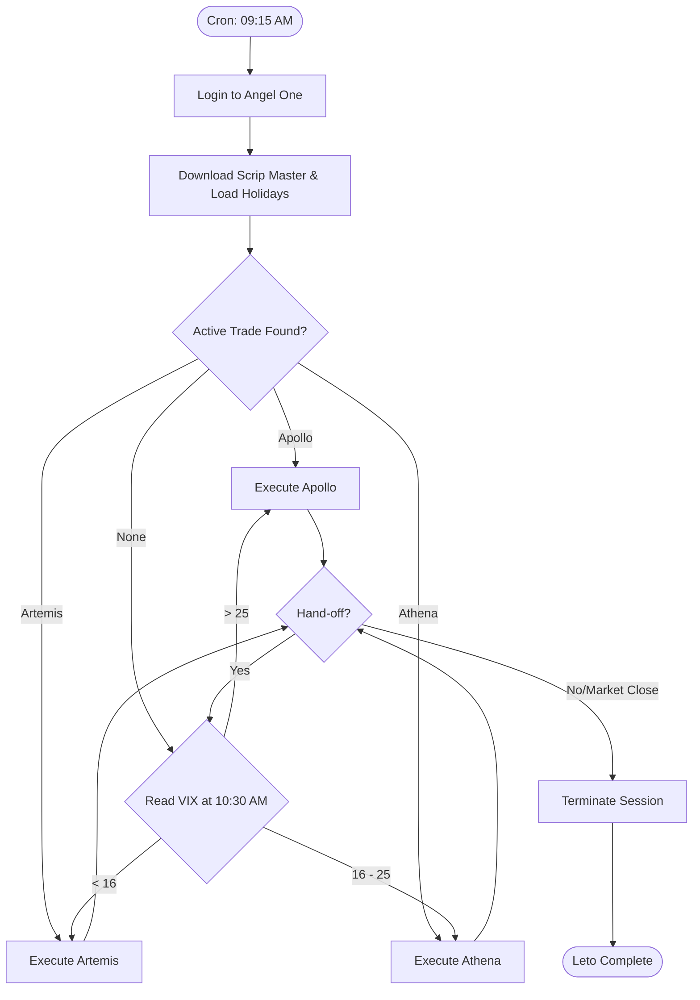

# Algo Trading Lab

A personal algorithmic trading laboratory for backtesting, optimising, and automating strategies for Indian Index Options.

## Strategies

### [Artemis](./artemis_production/) — Sensex Dynamic Credit Spread
A market-neutral credit spread strategy that starts as a weekly Sensex Iron Condor. During trends, it dynamically transforms into a **directional credit spread** by exiting the tested side and reinforcing the winning side with rolled strikes and additional lots (position sizing scales up to 150% of the base).

| | |
|---|---|
| Instrument | Sensex weekly options |
| Structure | Iron Condor → Reinforced Directional Spread |
| Entry | Monday 10:30 AM |
| Expiry | Thursday |
| Adjustments | Dynamic strike rolling + lot reinforcement (1.5x) |
| Broker | Angel Broking (SmartConnect) |
| Status | Live |

### [Apollo](./apollo_production/) — Nifty High-VIX Trend Following
A directional ITM debit spread strategy deployed when India VIX > 25. Uses dual-timeframe Supertrend (75-min and 15-min) to identify and trade sustained directional moves in Nifty options.

| | |
|---|---|
| Instrument | Nifty weekly options |
| Structure | ITM debit spread (directional, one side only) |
| Signal | Dual Supertrend — 75-min regime, 15-min entry/exit |
| Deploy condition | India VIX > 25 |
| Broker | Angel Broking (SmartConnect) |
| Production config | D-R-D06g |
| Status | Live |

### [Athena](./athena_production/) — Nifty Double Calendar Condor
A market-neutral, theta-positive strategy designed for mid-regime VIX (16–25). Executes a double calendar spread on Nifty weekly options with far-OTM safety wings to cap extreme gap risk. Long-vega profile benefits from IV expansion.

| | |
|---|---|
| Instrument | Nifty weekly options |
| Structure | Double calendar condor (5-6 legs) |
| Entry | Day before previous weekly expiry, 10:30 AM |
| Exit | Day before sell expiry, 10:25 AM (ELM) |
| Sell expiry | Next weekly expiry from entry (~8 DTE) |
| Buy expiry | Nearest monthly expiry with DTE ≥ 16 |
| Deploy condition | India VIX 16–25 |
| Target Deltas | Sold: 0.30, Wings: 0.05 |
| Broker | Angel Broking (SmartConnect) |
| Status | Live |

## Session Router

### [Leto](./leto.py) — Strategy Router and Session Manager
Single cron entry point. Logs in to Angel One, checks market hours and holidays, downloads the scrip master, reads VIX, and routes to Apollo, Athena, or Artemis. Owns the full session lifecycle — `generateSession` and `terminateSession` are called exactly once per day, here.

**Routing logic:**
1. If an active Apollo trade is found in `apollo_state.csv` — route to Apollo regardless of VIX or day.
2. If an active Athena trade is found in `athena_state.csv` — route to Athena regardless of VIX or day.
3. If an active Artemis trade is found in `pe_trade_params.csv` or `ce_trade_params.csv` — route to Artemis regardless of VIX or day.
4. If no open position exists:
   - **VIX ≤ 16.0** → Artemis (Mon-Thu only)
   - **16.0 < VIX ≤ 25.0** → Athena (Mon-Thu only)
   - **VIX > 25.0** → Apollo (Any day)
5. **Handoff Mechanism:** If a strategy stands down due to a VIX breach at 10:30 AM, Leto re-evaluates routing.

### Orchestration Flow



## Resilient Order Execution

All production strategies (Artemis, Apollo, Athena) implement a robust order placement engine designed to handle broker API failures:

- **Ghost Order Protection:** Catches `DataException` (triggered by empty `b''` responses). Before retrying, the engine polls the Order Book to verify if the order was successfully received by the broker backend despite the malformed response.
- **Smart Rate-Limit Handling:** Detects "access rate" errors and enforces a mandatory 2-second cooldown to clear the rate-limit bucket before retrying.
- **Network Resilience:** Specifically handles `NetworkException` with a 5-second backoff to allow for temporary connection stability.
- **Session Kill Switch:** Detects session-level failures (invalid tokens) and aborts execution to return control to Leto, preventing infinite failing retry loops.
- **Fill Verification:** Uses iterative `while` loops for quantity splitting to ensure exactly the requested lot count is processed, preventing lot dropping due to freeze-limit math errors.

## Infrastructure

| Component | Details |
|---|---|
| VPS | Linode Nanode — hostname `delos` |
| OS | Ubuntu 24.04 |
| Laptop | Garuda Linux (Arch-based) |
| Broker (live) | Angel Broking (SmartConnect API) |
| Broker (data) | ICICI Direct (Breeze) for Nifty, Angel Broking for Sensex |
| Notifications | Slack |
| Language | Python |

## Slack Messaging

The laboratory is integrated with Slack for real-time monitoring and alerting. Each strategy and the data pipeline route messages to specific channels based on the event priority.

### Monitoring Channels

| Channel | Purpose | Sources |
| :--- | :--- | :--- |
| **`#trade-alerts`** | High-priority trade events: entries, exits, adjustments, and SL hits. | Artemis, Athena, Apollo |
| **`#trade-updates`** | Periodic status updates: LTP tracking, current P&L, and peak drawdown/profit. | Artemis, Athena |
| **`#tradebot-updates`** | Session lifecycle: Login success, strategy routing, session termination, and archival. | Leto, Apollo |
| **`#error-alerts`** | Fatal exceptions, rate limit cooling, ghost order recoveries, and network timeouts. | All Strategies, Leto, Data Pipeline |
| **`#data-alerts`** | Pipeline status: Start/End notifications and daily download completion reports. | Data Pipeline |

### Automated Pipeline Messaging

The `data_pipeline/` infrastructure uses a dual-layer messaging system:

1.  **Shell Wrappers (`run_*.sh`):**
    -   **Start Warning:** Posts to `#data-alerts` when the downloader starts (e.g., "⚠️ *Sensex Downloader* – Run started. Do not push to GitHub.").
    -   **System Errors:** Posts to `#error-alerts` if `git pull` or `git push` fails during the sync process.
    -   **Final Status:** Posts a success (✅) or failure (🚨) notification with a mention (`<@MEMBER_ID>`) upon completion.
2.  **Python Downloaders (`weekly_option_data_*.py`):**
    -   Post detailed completion summaries and any API-level warnings to `#data-alerts`.

## VIX Regime

| VIX Level | Strategy |
|---|---|
| < 16 | Artemis |
| 16 – 25 | Athena |
| > 25 | Apollo |

Open position detection overrides VIX routing in all cases — an active Apollo, Artemis, or Athena trade is always resumed to completion regardless of current VIX or day of week.

## Regulatory Compliance

The laboratory is designed with structural safeguards to ensure strict adherence to Indian market regulations and SEBI mandates.

### ELM & Calendar Spread Margin Compliance
The system is in complete compliance with circular **[SEBI/HO/MRD/TPD-1/P/CIR/2024/132](https://www.sebi.gov.in/legal/circulars/oct-2024/measures-to-strengthen-equity-index-derivatives-framework-for-increased-investor-protection-and-market-stability_87208.html)** regarding the removal of Calendar Spread margin benefits on expiry day and increased Extra Loss Margin (ELM) requirements.
- **Artemis:** Actively rolls hedges inward and exits additional lots on the day prior to expiry to mitigate ELM spikes.
- **Athena:** Enforces a hard pre-expiry exit at 10:25 AM the day before expiry specifically to eliminate exposure during the margin-benefit removal window.
- **Apollo:** Implements a hard pre-expiry exit at 15:15 the day before expiry to avoid overnight margin spikes and potential liquidity issues on expiry day.

### Retail Algorithmic Trading Compliance
The system is in complete compliance with circular **[SEBI/HO/MIRSD/MIRSD-PoD/P/CIR/2025/0000013](https://www.sebi.gov.in/legal/circulars/feb-2025/safer-participation-of-retail-investors-in-algorithmic-trading_91614.html)** regarding safer participation of retail investors in algorithmic trading.
- **Order Management:** Enforces a strict limit of **10 orders per second** as mandated by SEBI for retail participants. Additionally, the system implements granular client-side rate limiting for broker-specific endpoints (RMS=2, OrderBook=1, LTP=10, Candles=3) to prevent burst-traffic and maintain operational stability.
- **Traceability:** All production execution is routed through a fixed, static IPv4 address (Linode VPS `delos`) registered with the broker for end-to-end auditability and compliance with retail algo traceability norms.

## Cron (delos)

Single cron entry replaces all previous per-strategy crons:

```
15 9 * * 1-5 cd /home/parijnan/scripts/algo-trading-lab && /home/parijnan/anaconda3/bin/python leto.py >> logs/leto_$(date +\%Y\%m\%d).log 2>&1
```

## Data Pipeline
Historical 1-minute OHLCV data for Nifty and Sensex options and indices is maintained by an automated pipeline. See `data_pipeline/` for scripts and config.

| Data | Source | Schedule | Coverage |
|---|---|---|---|
| Sensex options + all indices | Angel Broking — VPS cron via `run_sensex_downloader.sh` | Daily at 15:45 | Mid-2024 onwards |
| Nifty options | ICICI Breeze — laptop cron via `run_nifty_downloader.sh` | Tuesdays at 23:30 | May 2019 onwards |
| Nifty options (Real-time) | Angel Broking — Manual via `angel_nifty_backtest_data.py` | As needed | Apr 2026 onwards |

### Pipeline design
- 1-minute OHLCV data, saved as CSV, organised by expiry date
- Sensex and Nifty options: one file per contract (`{strike}{ce|pe}.csv`), one folder per expiry (`YYYY-MM-DD/`)
- Index files: single rolling CSV per index (`sensex.csv`, `nifty.csv`, `india_vix.csv`)
- Incremental saves — each file is written after every 2-day chunk, no data loss on interruption
- Resume on restart — picks up from the last saved timestamp in each file
- Sliding-window rate limiter enforcing broker API limits (AngelOne: 2/sec, 180/min, 5000/hr; Breeze: 100/min, 5000/day)
- Slack notifications on completion (`#data-alerts`) and fatal errors (`#error-alerts`)
- `download_status` flag in config CSVs tracks which expiries are fully downloaded

### Timestamp formats
| File type | Format |
|-----------|--------|
| Index files | `YYYY-MM-DD HH:MM:SS+05:30` |
| Sensex options files | `YYYY-MM-DDTHH:MM:SS+05:30` |
| Nifty options files | As returned by Breeze API |

### AngelOne API
- `getCandleData()` — max 1000 records per call; 2 trading days per chunk (375 min × 2 = 750 records)
- Exchange codes: `BFO` (Sensex options), `BSE` (Sensex index), `NSE` (Nifty / India VIX)
- Options identified by token from `instrument_master.csv` (auto-refreshed daily)
- Strike prices stored as strike × 100 in instrument master (e.g. `8700000` = 87000)
- Expiry dates stored as `DDMMMYYYY` in instrument master (e.g. `24SEP2026`)
- Broker returns random dates when no data exists — window guard discards out-of-range rows
- Data retained on broker servers for ~1-2 weeks post-expiry — daily cron ensures same-day capture

### ICICI Breeze API
- `get_historical_data()` — no per-call record limit; full date range in a single call
- Contracts identified by strike price, right (call/put), and expiry date — no token lookup
- Data retained for a rolling 3-year window
- Session authentication requires Selenium (headless Chrome) — runs on laptop only

### Data storage
Data files are not tracked by git. On each machine, a `data/` directory sits alongside the pipeline scripts:

**VPS** (`/home/parijnan/scripts/algo-trading-lab/data_pipeline/data/`):
```
data/
├── user_credentials_angel.csv    # not in git
├── instrument_master.csv         # not in git — auto-refreshed daily
├── indices/
│   ├── sensex.csv
│   ├── nifty.csv
│   └── india_vix.csv
└── sensex/
    └── YYYY-MM-DD/
        ├── 78000ce.csv
        └── 78000pe.csv
```

**Laptop** (`/home/parijnan/scripts/algo-trading-lab/data_pipeline/data/`):
```
data/
├── user_credentials_icici.csv    # not in git
├── indices/                      # synced from VPS via sync_data.sh
├── sensex/                       # synced from VPS via sync_data.sh
└── nifty/
    ├── options/                  # ICICI Breeze data (standard)
    │   └── YYYY-MM-DD/
    └── temp/                     # Angel One data (real-time backtesting)
        └── YYYY-MM-DD/
```

## Consolidated Portfolio Performance (2020–2026)

The following benchmark represents the \"Gold Standard\" performance of the lab's core strategies over a 6-year backtest (**2019-12-31 to 2026-04-20**). All results are **normalised to a ₹1.04L capital base** (Artemis base) for accurate portfolio comparison.

| Strategy | VIX Regime | Trade Count | Total P&L (₹) | **Normalised P&L (₹)** | Win Rate |
| :--- | :--- | :---: | :---: | :---: | :---: |
| **Artemis** | < 16 | 177 | ₹145,899 | **₹145,899** | ~69% |
| **Athena** | 16 – 25 | 121 | ₹139,200 | **₹120,641** | ~58% |
| **Apollo** | > 25 | 18 | ₹46,160 | **₹24,003** | ~61% |
| **Total** | | **316** | **₹331,259** | **₹290,543** | **~64%** |

### Risk & Portfolio Metrics
*Calculated over the full 6-year unified equity curve.*

| Metric | Unified Portfolio | Nifty 50 (Benchmark) |
| :--- | :---: | :---: |
| **Sharpe Ratio** | **1.19** | 0.25 |
| **Sortino Ratio** | **2.80** | 0.34 |
| **Max Drawdown** | **-4.62%** | -38.4% (Mar 2020) |
| **Recovery Speed** | **77 Days** | ~220 Days |
| **Annualised Vol** | **8.54%** | 14.78% |
| **Portfolio Beta** | **0.01** | 1.00 |

*Note: Apollo results are based on the latest 15-min Supertrend logic with a strict VIX > 25 gate. All metrics account for idle time and assume a 5% risk-free rate.*

---

## Phase 3 Research: ML Regime Adaptation

Research into replacing fixed VIX/Supertrend routing with a LightGBM/HMM regime classifier. Focuses on "Spatial Coordinates" (Price-EMA tension) and "Institutional Intent" (1-minute OI accumulation).

| | |
|---|---|
| Framework | Solo Quant ML Architecture |
| Model | LightGBM Classifier |
| Features | DTEMA 20, PCR Velocity, Risk Signals |
| Goal | Stealth Trend detection |
| Status | **Research Lab (Underperforms Phase 2)** |

### Verdict
Research into ML-based regime adaptation (LightGBM and HMM) using "Spatial Price-VIX" coordinates and "Institutional Intent" (1-min OI accumulation) proved that while these features offer higher precision in backtests, they introduce significant overfitting risk and execution latency. The simpler, rule-based VIX regime routing of Phase 2 consistently provided superior risk-adjusted returns and operational stability in real-world scenarios.

---

## Phase 4 Research: Strategic Convergence

Research into unifying Artemis, Athena, and Apollo into a single Nifty-based portfolio managed by a dynamic version of Leto.

| | |
|---|---|
| Framework | Unified Nifty Portfolio |
| Logic | Dynamic VIX/Trend Handoffs |
| Objective | Greek-Based Portfolio Management |
| Status | **Research Complete (Underperforms Phase 2)** |

### Verdict
Exploration of Phase 4 (Nifty translation for Artemis and dynamic strategy morphing) has been completed. Similar to Phase 3 ML research, the increased complexity of dynamic handoffs and unified underlyings resulted in lower risk-adjusted returns compared to the isolated VIX-regime architecture of Phase 2. The lab will continue to operate on the **Phase 2 Baseline** for production execution.

For the archival details, see the [Phase 4 Research Document](./plans/phase-4-convergence.md).

---

## Repository Structure

```
algo-trading-lab/
├── README.md
├── .gitignore
├── analyze_broker_state.py         # Utility for post-market margin and orderbook analysis
├── leto.py                         # Session router and strategy entry point
├── data/                           # Shared runtime data (credentials, holidays)
│   ├── user_credentials.csv        # not in git
│   └── holidays.csv
├── logs/                           # Leto session logs — gitignored, created at runtime
├── artemis_production/             # Live Sensex dynamic iron condor
│   ├── README.md
│   ├── artemis.py
│   ├── iron_condor.py
│   ├── credit_spread.py
│   ├── configs.py
│   ├── functions.py
│   └── data/
│       ├── contracts.csv
│       ├── trade_settings.csv
│       ├── user_credentials.csv    # symlink → ../data/user_credentials.csv
│       ├── holidays.csv            # symlink → ../data/holidays.csv
│       └── archived/
├── artemis_backtest/               # Artemis historical backtesting and optimisation
│   ├── README.md
│   ├── configs.py
│   ├── generate_contracts.py
│   ├── contracts.csv               (generated by generate_contracts.py)
│   ├── backtest.py
│   ├── data_loader.py
│   └── data/
│       ├── trade_summary.csv       (generated by backtest.py)
│       └── trade_logs/             (generated by backtest.py)
├── apollo_production/              # Live Nifty debit spread strategy
│   ├── README.md
│   ├── configs_live.py
│   ├── apollo.py
│   ├── supertrend.py
│   ├── state.py
│   ├── websocket_feed.py
│   ├── functions.py
│   ├── logger_setup.py
│   ├── technical_indicators.py
│   ├── tests/
│   │   └── ws_test.py
│   ├── data/
│   │   ├── user_credentials.csv    # symlink → ../data/user_credentials.csv
│   │   ├── holidays.csv            # symlink → ../data/holidays.csv
│   │   └── .gitkeep                # runtime data gitignored
│   └── logs/                       # gitignored, created at runtime
├── apollo_backtest/                # Apollo backtesting and optimisation
│   ├── README.md
│   ├── ml_feature_engineering.py   # Spatial Price-VIX feature generator
│   ├── oi_aggregator.py            # 1-min Institutional OI dynamics
│   ├── leto_phase2_simulation.py   # Signal ensemble and routing logic
│   ├── configs_credit.py           # Phase 1 credit spread config (reference only)
│   ├── configs_debit.py            # Phase 1 debit spread — production config D-R-D06g
│   ├── configs_debit_phase2.py     # Phase 2 triple-timeframe config (in progress)
│   ├── technical_indicators.py     # Shared by Phase 1 and Phase 2
│   ├── precompute.py               # Phase 1 precompute
│   ├── precompute_phase2.py        # Phase 2 precompute
│   ├── backtest_credit.py          # Phase 1 credit spread (reference only)
│   ├── backtest_debit.py           # Phase 1 debit spread — translated to production
│   ├── backtest_debit_phase2.py    # Phase 2 triple-timeframe (in progress)
│   └── data/
│       ├── nifty_15min.csv         (generated — gitignored)
│       ├── nifty_75min.csv         (generated — gitignored)
│       ├── vix_daily.csv           (generated — gitignored)
│       └── trade_logs/             (generated — gitignored)
├── athena_production/              # Live Nifty double calendar condor strategy
│   ├── README.md
│   ├── athena_engine.py
│   ├── configs_live.py
│   ├── state.py
│   ├── functions.py
│   ├── logger_setup.py
│   └── data/
│       └── .gitkeep                # runtime data gitignored
├── athena_backtest/                # Athena double calendar backtesting
│   ├── README.md
│   ├── backtest_wing_salvage.py    # Research: Tactical wing exiting
│   ├── backtest_ml_adaptive.py     # Research: ML-driven tactical adjustments
│   ├── backtest_adaptive_exit.py   # Experiment: 15:15 entry with VIX-based adaptive exit
│   ├── backtest_realtime.py        # Real-time simulation logic for current month
│   ├── backtest_phase1.py          # Legacy Phase 1 backtest logic
│   ├── configs.py                  # Production-spec backtest config
│   ├── configs_adaptive_exit.py    # Adaptive exit experiment config
│   ├── configs_realtime.py         # Real-time simulation config
│   ├── configs_phase1.py           # Legacy Phase 1 config
│   ├── data/                       # Standard backtest results (gitignored)
│   │   ├── trade_summary.csv
│   │   └── trade_logs/
│   ├── data_realtime/              # Real-time simulation results (gitignored)
│   │   ├── trade_summary.csv
│   │   └── trade_logs/
│   └── data_adaptive_exit/         # Experiment results (gitignored)
│       ├── trade_summary.csv
│       └── trade_logs/
└── data_pipeline/                  # Automated historical data download
    ├── README.md
    ├── weekly_option_data_sensex.py
    ├── weekly_option_data_nifty.py
    ├── run_sensex_downloader.sh
    ├── run_nifty_downloader.sh
    ├── rename_legacy_files.py
    ├── delete_empty_files.py
    ├── config/
    │   ├── options_list_sensex.csv
    │   └── options_list_nf.csv
    └── data/                       (excluded from git — raw market data)
        ├── indices/
        ├── sensex/
        └── nifty/
            └── options/
```