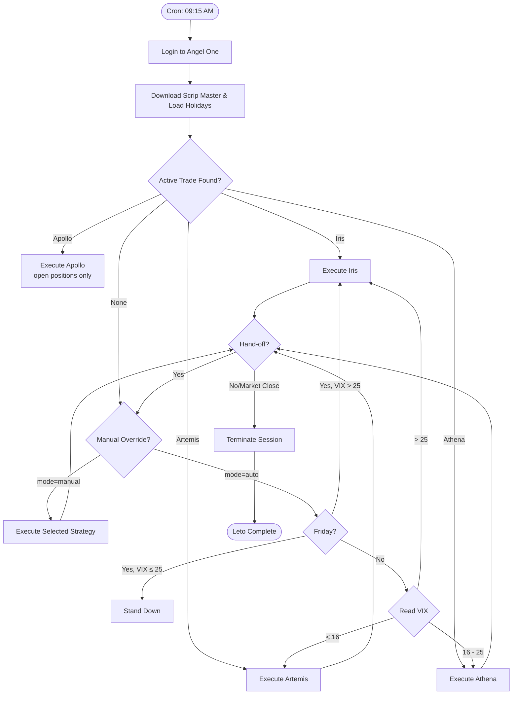

# Algo Trading Lab

A personal algorithmic trading laboratory for backtesting, optimising, and automating strategies for Indian Index Options.

## Strategies

### [Iris](./iris_production/) — Nifty Directional Scalping

Directional scalping strategy — active at VIX > 25. Auto-enters on ST_FAST (5m+15m dual
supertrend) signals. Buys a single ITM-150 Nifty weekly call/put. Exits on profit target,
stop loss, trend flip, or 30-min per-trade timer. Routed by Leto; runs under Leto's session.

| | |
|---|---|
| Instrument | Nifty weekly options — long ITM-150 call/put, nearest expiry |
| Signal | ST_FAST — 5-min ST flip aligned with 15-min regime (~200/year) |
| Entry | Market order, 5-min after signal bar close |
| Position size | 40 lots (static, `LOT_COUNT=40` in configs.py) |
| Profit target | 10% of entry premium |
| Stop loss | 25% of entry premium |
| Max hold | 30 min per trade · last entry 15:00 open · daily cutoff 15:15 |
| Skip window | 10:45–11:30 (dead zone — post-opening settling) |
| Backtest | 1,172 trades · WR 59.3% · Avg ₹234/lot · Median ₹480/lot (7.4 yr) |
| Status | **Live** — `DRY_RUN=False`, 40 lots static |

### [Artemis](./artemis_production/) — Sensex Dynamic Credit Spread
A market-neutral credit spread strategy that starts as a weekly Sensex Iron Condor. During trends, it dynamically transforms into a **directional credit spread** by exiting the tested side and reinforcing the winning side with rolled strikes and additional lots (position sizing scales up to 150% of the base).

| | |
|---|---|
| Instrument | Sensex weekly options |
| Structure | Iron Condor → Reinforced Directional Spread |
| Entry | Monday 10:30 AM |
| Expiry | Thursday |
| Adjustments | Dynamic strike rolling + lot reinforcement (1.5x) |
| Broker | Angel Broking (SmartConnect) |
| Status | Live |

### [Apollo](./apollo_production/) — Nifty High-VIX Trend Following *(retired from routing)*
A directional ITM debit spread strategy. Net-negative at VIX > 25 (−₹12/trade). Replaced by Iris at the VIX > 25 slot. Apollo is retained in Leto solely to manage any remaining open positions — no new entries are routed to it.

| | |
|---|---|
| Instrument | Nifty weekly options |
| Structure | ITM debit spread (directional, one side only) |
| Signal | Dual Supertrend — 75-min regime, 15-min entry/exit |
| Deploy condition | **Retiring** — manages open positions only |
| Broker | Angel Broking (SmartConnect) |
| Production config | D-R-D06g |
| Status | Live (open position management only) |

### Aphrodite — Intraday Iron Condor (shelved)
Originally conceived to deploy idle capital during VIX < 11 phases while Apollo ran on
₹8L margin. **Shelved (June 2026):** Apollo is retired from the routing map; Artemis now
covers VIX < 16, leaving no idle-capital scenario for Aphrodite to exploit. Feasibility
analysis and design notes archived in `plans/aphrodite.md`. Revisit only if a VIX < 11
strategy is deployed that leaves substantial capital idle.

| | |
|---|---|
| Instrument | Nifty weekly options |
| Structure | Iron condor — 2σ sell, 3σ hedge |
| Original deploy condition | VIX open < 11, DTE ≥ 4, net credit ≥ 5pts after slippage |
| Status | **Shelved** — premise removed by Apollo retirement |

### [Athena](./athena_production/) — Nifty Double Calendar Condor
A market-neutral, theta-positive strategy designed for mid-regime VIX (16–25). Executes a double calendar spread on Nifty weekly options with far-OTM safety wings to cap extreme gap risk. Long-vega profile benefits from IV expansion.

| | |
|---|---|
| Instrument | Nifty weekly options |
| Structure | Double calendar condor (5-6 legs) |
| Entry | Day before previous weekly expiry, 10:30 AM |
| Exit | Day before sell expiry, 10:25 AM (ELM) |
| Sell expiry | Next weekly expiry from entry (~8 DTE) |
| Buy expiry | Nearest monthly expiry with DTE ≥ 16 |
| Deploy condition | India VIX 16–25 |
| Target Deltas | Sold: 0.30, Wings: 0.05 |
| Broker | Angel Broking (SmartConnect) |
| Status | Live |

## Session Router

### [Leto](./leto.py) — Strategy Router and Session Manager
Single cron entry point. Logs in to Angel One, checks market hours and holidays, downloads the scrip master, reads VIX, and routes to Iris, Athena, or Artemis. Owns the full session lifecycle — `generateSession` and `terminateSession` are called exactly once per day, here.

**Routing logic (current live — 3-way gate):**
1. If an active Apollo trade is found in `apollo_state.csv` — route to Apollo (transition: manages remaining open positions only).
2. If an active Iris trade is found in `iris_state.csv` — route to Iris regardless of VIX or day.
3. If an active Athena trade is found in `athena_state.csv` — route to Athena regardless of VIX or day.
4. If an active Artemis trade is found in `pe_trade_params.csv` or `ce_trade_params.csv` — route to Artemis regardless of VIX or day.
5. **No open position, manual override active** → route unconditionally to the selected strategy (Artemis, Athena, or Iris) regardless of VIX or day of week (including Friday).
6. **Friday, no open position, auto mode:**
   - **VIX > 25.0** → Iris
   - **VIX ≤ 25.0** → Stand down
7. **Mon–Thu, no open position, auto mode — 3-way VIX route:**
   - **VIX ≤ 16.0** → Artemis
   - **16.0 < VIX ≤ 25.0** → Athena
   - **VIX > 25.0** → Iris
8. **Handoff Mechanism:** If a strategy stands down due to a VIX breach at 10:30 AM, Leto re-evaluates routing. `leto_config.py` is reloaded on each reroute iteration so a Slack override applied mid-session takes effect immediately.

**Manual routing override** is set via the Slack Control Panel (buttons: ⚡ Auto / 🔵 Force Artemis / 🟢 Force Athena / 🟣 Force Iris). Force overrides bypass VIX — the selected strategy routes unconditionally. The current mode is persisted in `data/routing_state.json` (gitignored) — `leto_config.py` reads from it on every reload.

| VIX Band | Strategy | Notes |
|----------|----------|-------|
| ≤ 16 | Artemis | Sensex iron condor |
| 16–25 | Athena | Nifty double calendar |
| > 25 | Iris | Nifty scalping (ST_FAST) |

### Orchestration Flow


```mermaid
graph TD
    Start([Cron: 09:15 AM]) --> Login[Login to Angel One]
    Login --> Setup[Download Scrip Master & Load Holidays]
    Setup --> CheckState{Active Trade Found?}

    CheckState -- Apollo --> RunApollo[Execute Apollo<br/>open positions only]
    CheckState -- Iris --> RunIris[Execute Iris]
    CheckState -- Athena --> RunAthena[Execute Athena]
    CheckState -- Artemis --> RunArtemis[Execute Artemis]

    CheckState -- None --> OverrideCheck{Manual Override?}
    OverrideCheck -- "mode=manual" --> RunOverride[Execute Selected Strategy]
    OverrideCheck -- "mode=auto" --> FridayCheck{Friday?}
    FridayCheck -- "Yes, VIX > 25" --> RunIris
    FridayCheck -- "Yes, VIX ≤ 25" --> StandDown[Stand Down]
    FridayCheck -- No --> VIXCheck{Read VIX}
    VIXCheck -- "< 16" --> RunArtemis
    VIXCheck -- "16 - 25" --> RunAthena
    VIXCheck -- "> 25" --> RunIris

    RunIris & RunAthena & RunArtemis & RunOverride --> Result{Hand-off?}
    Result -- Yes --> OverrideCheck
    Result -- No/Market Close --> Logout[Terminate Session]
    Logout --> End([Leto Complete])
```

## Resilient Order Execution

All production strategies (Artemis, Athena, Iris) implement a robust order placement engine designed to handle broker API failures:

- **ID-Exclusion Ghost Recovery:** Catches `DataException` and `NetworkException`. Instead of blind retries, the engine maintains a session list of processed IDs and reconciles the Order Book using documented fields (`symbol`, `qty`, `type`) to identify and recover lost orders, preventing double-fills during connectivity issues.
- **Proactive Rate Limiting:** Enforces a strict limit of **10 orders per second** as mandated by SEBI for retail participants. A client-side gatekeeper tracks timestamps and enforces a proactive 1.1s sleep *before* the 11th order is fired.
- **Sub-Second Verification:** Uses an "Execution-Burst, Verification-Second" pattern. Batch fills are verified instantly (typically <200ms) with a 1.1s safety window for discrepancies.
- **Session Kill Switch:** Detects session-level failures (invalid tokens) and aborts execution to return control to Leto, preventing infinite failing retry loops.
- **Fill Verification:** Uses iterative `while` loops for quantity splitting to ensure exactly the requested lot count is processed, preventing lot dropping due to freeze-limit math errors.
- **Orphan Fill Cleanup:** Post-burst audit after every entry. If one leg fills more than another, the excess is immediately squared off with a counter-order to maintain balanced exposure across all legs. Athena handles this across batches.
- **WebSocket Order Fill Verification:** All strategies run a background `OrderFillWatcher` daemon thread (subclassing `SmartWebSocketOrderUpdate`) that captures AB05/AB02/AB03 events into a thread-safe `live_orders` dict. `_fetch_order_details` polls this dict every 50ms instead of calling `orderBook()`, reducing fill verification from ~1s REST round-trips to <300ms. If the socket is not ready or times out, the original REST fallback is used transparently.
- **Real-Time WebSocket LTP Feed:** All strategies start a `SharedFeed` daemon thread (`websocket_feed.py`) at session open. Index tokens (Nifty or Sensex) are pre-subscribed at connect; option leg tokens are subscribed after entry and unsubscribed after exit. In-trade monitoring loops run at 500ms intervals (versus previous 20–60s REST polling), decoupling sub-second SL/parachute reaction from the configurable Slack reporting cadence. If the WebSocket disconnects mid-session, `SharedFeed` attempts reconnection with exponential backoff (5→10→20→40→60s, up to 5 attempts), resubscribes all tokens on success, and sends a Slack alert via the caller's `alert_callback`. During reconnect, strategies fall back to REST polling at the full configured interval. If all reconnect attempts fail, the REST fallback remains active and a final alert fires to `#error-alerts`.
- **Tick Error Debouncing:** Malformed or undecodable WS ticks are silently discarded by the feed thread and counted. After 10+ errors within a 5-minute window, a single Slack alert fires to `#error-alerts`. Repeated flapping is suppressed by a 300s cooldown on alerts.
- **Stale Tick Watchdog:** A background daemon checks every 30s whether any subscribed token has gone silent for more than 2 minutes while the connection is healthy (confirmed live by the broker's 10s ping/pong). If so, a Slack alert fires to `#error-alerts`, debounced per token at 5 minutes. This distinguishes feed failures (caught by `on_close`/`on_error`) from illiquid contracts — primarily the deep-OTM PE wing in Athena, which may trade infrequently.
- **Position Reconciliation on Restart:** When Leto routes to a strategy that already has an open trade in state (e.g., after a VPS reboot), the strategy calls `obj.position()` and compares broker-reported quantities against state. Mismatches generate an immediate Slack alert to `#error-alerts` before monitoring resumes; the system never auto-corrects — manual verification is required.
- **Async Slack Messaging:** All three strategies route Slack calls through a per-module fire-and-forget queue. `slack_bot_sendtext()` enqueues the message and returns immediately; a daemon `SlackWorker` thread drains the queue and makes the actual HTTP POST. A 5s Slack timeout never stalls the 500ms monitoring loop. The queue is bounded at 200 items — if full, the message is dropped and a warning is logged. Telegram fallback on Slack failure runs inside the worker thread, not the main thread.
- **Candle-Fetch Retry & Backfill:** Apollo and Iris both proactively rate-limit `getCandleData` (client-side `CANDLE_POLL_LIMIT=3`/sec, matching the retail-algo compliance table above) and escalate a failed fetch to an outer retry loop (5 attempts, 10s apart) before giving up on a bar. A bar that still can't be fetched goes into a persistent missed-candle queue, retried every subsequent loop iteration and merged into the Supertrend history in correct chronological order once recovered — never silently dropped. Iris's retry loop is non-blocking (tracks a "next retry due" timestamp rather than sleeping inline), since its in-trade exit-monitoring loop must keep polling every 0.5–1s even while a candle fetch is being retried — unlike Apollo, which has no equivalent tight monitoring loop running concurrently with its own candle-fetch retries.

## Slack Interactive Control

The laboratory is managed remotely via a dedicated **#actions** Slack channel using an interactive **Control Panel**. This eliminates the need for SSH access during market hours and ensures human-in-the-loop safety.

### Circuit Breakers (Socket Mode)
A dedicated `slack_listener.py` daemon runs on the VPS, using Slack Socket Mode to receive real-time commands:
- **`⚠️ Exit Trade`**: Liquidates all active positions across all strategies and halts the bot immediately.
- **`🚨 Kill Switch`**: Drops automated control immediately without liquidating. Positions remain open for manual intervention.
- **`⏸️ Disable Algo`**: Sets a persistent flag that prevents Leto from starting any new sessions or routing to strategies.
- **`✅ Clear Flag`**: Removes all blocking flags to resume normal automated operations.
- **`🚀 Start Leto`**: Manually triggers the `leto.py` orchestrator outside of the standard cron schedule.
- **`🔄 Reset State`**: Resets all strategy state files to idle without placing any orders. Iris and Athena have their `status` column set to `idle`; Artemis state CSVs are fully archived. Intended for use after manually closing positions directly via the broker app.
- **`⬇️ Git Pull`**: Runs `git pull` on the VPS and posts the output to `#tradebot-updates`. Eliminates the need to SSH in for routine code updates. Note: if `slack_listener.py` itself is updated, a manual restart of the listener is still required to pick up those changes.

### Manual Adjustment
Mid-session adjustments for Artemis and Athena, executed via each strategy's own order engine on the next monitoring cycle (≤ 0.5s). If the strategy is not actively running, the flag remains on disk until cleared.

- **`🔧 Adjust Artemis`**: opens a modal to select which side to exit (PE or CE). The algo exits that spread and rolls the other side's sell inward using the same `adjust_spread()` logic as an SL-triggered adjustment (roll distance and additional lots per `trade_settings.csv`).
- **`🪂 Adjust Athena`**: opens a modal with four options:
  - *Enter CE Parachute* — buys the OTM CE hedge using the same delta-targeting logic as the auto-trigger, bypassing the spot condition and attempt cap.
  - *Exit CE Parachute* — closes the active CE hedge, bypassing the spot exit condition.
  - *Enter PE Wing* — buys the reactive PE wing using the same delta-targeting logic as the auto-trigger, bypassing the spot drop trigger condition.
  - *Exit PE Wing* — closes the active PE wing, bypassing the spot recovery condition.

### Routing and Sizing Override
Four routing buttons and the sizing modal live together in one section:
- **`⚡ Auto (VIX)`**: Restores standard VIX-based routing (default state).
- **`🔵 Force Artemis`**: Routes unconditionally to Artemis regardless of VIX.
- **`🟢 Force Athena`**: Routes unconditionally to Athena regardless of VIX.
- **`🟣 Force Iris`**: Routes unconditionally to Iris regardless of VIX.
- **`⚙️ Manage Sizing`**: Opens a modal for surgical position sizing updates — toggle between Dynamic Auto-Sizing and Fixed Lots, and set the lot count for Artemis, Athena, or Iris. Updates are written to a gitignored `data/sizing_override.json` inside each strategy directory; the strategy reads this at startup and overrides the defaults in its own `<strategy>_configs.py`.

The routing mode is persisted in `data/routing_state.json` (gitignored, defaults to `auto/artemis` if absent). `leto_config.py` reads from it on every `importlib.reload()`, so a change applied mid-session takes effect on the next Leto loop without a restart.

### Maintenance
- **`⬇️ Git Pull`**: Runs `git pull` on the VPS and posts the output to `#tradebot-updates`. Note: if `slack_listener.py` itself is updated, a manual service restart is required to pick up the changes.

## Infrastructure

| Component | Details |
|---|---|
| VPS | Linode Nanode — hostname `delos` |
| OS | Ubuntu 24.04 |
| Laptop | Garuda Linux (Arch-based) |
| Broker (live) | Angel Broking (SmartConnect API) |
| Broker (data) | ICICI Direct (Breeze) for Nifty, Angel Broking for Sensex |
| Notifications | Slack |
| Language | Python |

## Slack Messaging

The laboratory is integrated with Slack for real-time monitoring and alerting. Each strategy and the data pipeline route messages to specific channels based on the event priority.

### Monitoring Channels

| Channel | Purpose | Sources |
| :--- | :--- | :--- |
| **`#trade-alerts`** | High-priority trade events: entries, exits, adjustments, and SL hits. | Artemis, Athena, Apollo |
| **`#trade-updates`** | Periodic status updates: LTP tracking, current P&L, and peak drawdown/profit. | Artemis, Athena, Apollo |
| **`#tradebot-updates`** | Session lifecycle: Login success, strategy routing, WebSocket LTP/order-fill feed startup, session termination, archival, and end-of-day session report. | Leto, Artemis, Athena, Apollo |
| **`#error-alerts`** | Fatal exceptions, rate limit cooling, ghost order recoveries, and network timeouts. | All Strategies, Leto, Data Pipeline |
| **`#data-alerts`** | Pipeline status: Start/End notifications and daily download completion reports. | Data Pipeline |

### End-of-Day Session Report

After session teardown, Leto posts a formatted summary to `#tradebot-updates` covering every strategy that ran that day. Each block includes:

- **Entry/exit times** — when a trade was resumed from a prior session, the entry date is shown (`20 May 10:30`) so it is clearly distinguished from a same-day entry.
- **Strategy context** — Apollo: direction; Athena: spot move entry→exit; Artemis: outcome (Neutral / PE side closed — CE reinforced / CE side closed — PE reinforced).
- **P&L** — points and rupees for exited trades. For overnight holds: unrealised P&L snapshotted at market close from live LTPs, labelled `(unrealised at close)`. Falls back to `Position carried forward overnight` if the feed is unavailable at close.
- **Peak unrealised P&L** — high-water mark for the trade, shown for all strategies.
- **Session total** — realised P&L only; overnight hold unrealised figures are excluded from the total.

Overnight hold notifications (market close with open trade) are posted to `#trade-updates`. Artemis reports the outcome of any directional transformation that occurred during the week, and shows the original Monday entry time sourced from the trade book.

### Automated Pipeline Messaging

The `data_pipeline/` infrastructure uses a dual-layer messaging system:

1.  **Shell Wrappers (`run_*.sh`):**
    -   **Start Warning:** Posts to `#data-alerts` when the downloader starts (e.g., "⚠️ *AngelOne Downloader* – Run started. Do not push to GitHub.").
    -   **System Errors:** Posts to `#error-alerts` if `git pull` or `git push` fails during the sync process.
    -   **Final Status:** Posts a success (✅) or failure (🚨) notification with a mention (`<@MEMBER_ID>`) upon completion.
2.  **Python Downloaders (`data_downloader_*.py`):**
    -   Post detailed completion summaries and any API-level warnings to `#data-alerts`.

## VIX Regime

| VIX Level | Strategy |
|---|---|
| < 16 | Artemis |
| 16 – 25 | Athena |
| > 25 | Iris |

Open position detection overrides VIX routing in all cases — an active Artemis, Athena, or Iris trade is always resumed to completion regardless of current VIX or day of week.

The Slack routing override (Force Artemis / Force Athena / Force Iris) routes unconditionally to the selected strategy, bypassing VIX. Friday stand-down is not overridden.

## Regulatory Compliance

The laboratory is designed with structural safeguards to ensure strict adherence to Indian market regulations and SEBI mandates.

### ELM & Calendar Spread Margin Compliance
The system is in complete compliance with circular **[SEBI/HO/MRD/TPD-1/P/CIR/2024/132](https://www.sebi.gov.in/legal/circulars/oct-2024/measures-to-strengthen-equity-index-derivatives-framework-for-increased-investor-protection-and-market-stability_87208.html)** regarding the removal of Calendar Spread margin benefits on expiry day and increased Extra Loss Margin (ELM) requirements.
- **Artemis:** Actively rolls hedges inward and exits additional lots on the day prior to expiry to mitigate ELM spikes.
- **Athena:** Enforces a hard pre-expiry exit at 10:25 AM the day before expiry specifically to eliminate exposure during the margin-benefit removal window.
- **Apollo:** Implements a hard pre-expiry exit at 15:15 the day before expiry to avoid overnight margin spikes and potential liquidity issues on expiry day.

### Retail Algorithmic Trading Compliance
The system is in complete compliance with circular **[SEBI/HO/MIRSD/MIRSD-PoD/P/CIR/2025/0000013](https://www.sebi.gov.in/legal/circulars/feb-2025/safer-participation-of-retail-investors-in-algorithmic-trading_91614.html)** regarding safer participation of retail investors in algorithmic trading.
- **Order Management:** Enforces a strict limit of **10 orders per second** as mandated by SEBI for retail participants. Additionally, the system implements granular client-side rate limiting for broker-specific endpoints (RMS=2, OrderBook=1, LTP=10, Candles=3) to prevent burst-traffic and maintain operational stability.
- **Traceability:** All production execution is routed through a fixed, static IPv4 address (Linode VPS `delos`) registered with the broker for end-to-end auditability and compliance with retail algo traceability norms.

## Cron (delos)

Single cron entry replaces all previous per-strategy crons:

```
15 9 * * 1-5 cd /home/parijnan/scripts/algo-trading-lab && /home/parijnan/anaconda3/bin/python leto.py >> logs/leto_$(date +\%Y\%m\%d).log 2>&1
```

## Data Pipeline
Historical 1-minute OHLCV data for Nifty and Sensex options and indices is maintained by an automated pipeline. See `data_pipeline/` for scripts and config.

| Data | Source | Schedule | Coverage |
|---|---|---|---|
| Sensex options + all 1-min indices + daily Nifty, Sensex & VIX | Angel Broking — VPS cron via `run_angelone_downloader.sh` | Daily at 15:45 | Mid-2024 onwards |
| Nifty options | ICICI Breeze — laptop cron via `run_icicidirect_downloader.sh` | Wednesdays at 23:30 | May 2019 onwards |
| Nifty options (Real-time) | Angel Broking — Manual via `angel_nifty_backtest_data.py` | As needed | Apr 2026 onwards |

### Pipeline design
- 1-minute OHLCV data, saved as CSV, organised by expiry date
- Sensex and Nifty options: one file per contract (`{strike}{ce|pe}.csv`), one folder per expiry (`YYYY-MM-DD/`)
- Index files: single rolling CSV per index (`sensex.csv`, `nifty.csv`, `india_vix.csv`)
- Data integrity check on every index update: if fewer than 375 rows (one full trading day) are added, an alert fires to `#error-alerts` identifying the affected file
- Incremental saves — each file is written after every 2-day chunk, no data loss on interruption
- Resume on restart — picks up from the last saved timestamp in each file
- Sliding-window rate limiter enforcing broker API limits (AngelOne: 2/sec, 180/min, 5000/hr; Breeze: 100/min, 5000/day)
- Slack notifications on completion (`#data-alerts`) and fatal errors (`#error-alerts`)
- `download_status` flag in config CSVs tracks which expiries are fully downloaded

### Timestamp formats
| File type | Format |
|-----------|--------|
| Index files | `YYYY-MM-DD HH:MM:SS+05:30` |
| Sensex options files | `YYYY-MM-DDTHH:MM:SS+05:30` |
| Nifty options files | As returned by Breeze API |

### AngelOne API
- `getCandleData()` — max 1000 records per call; 2 trading days per chunk (375 min × 2 = 750 records)
- Exchange codes: `BFO` (Sensex options), `BSE` (Sensex index), `NSE` (Nifty / India VIX)
- Options identified by token from `instrument_master.csv` (auto-refreshed daily)
- Strike prices stored as strike × 100 in instrument master (e.g. `8700000` = 87000)
- Expiry dates stored as `DDMMMYYYY` in instrument master (e.g. `24SEP2026`)
- Broker returns random dates when no data exists — window guard discards out-of-range rows
- Data retained on broker servers for ~1-2 weeks post-expiry — daily cron ensures same-day capture

### ICICI Breeze API
- `get_historical_data()` — no per-call record limit; full date range in a single call
- Contracts identified by strike price, right (call/put), and expiry date — no token lookup
- Data retained for a rolling 3-year window
- Session authentication requires Selenium (headless Chrome) — runs on laptop only

### Data storage
Data files are not tracked by git. On each machine, a `data/` directory sits alongside the pipeline scripts:

**VPS** (`/home/parijnan/scripts/algo-trading-lab/data_pipeline/data/`):
```
data/
├── user_credentials_angel.csv    # not in git
├── instrument_master.csv         # not in git — auto-refreshed daily
├── indices/
│   ├── sensex.csv
│   ├── nifty.csv               # 1-min Nifty (last traded price)
│   ├── india_vix.csv           # 1-min India VIX
│   ├── nifty_daily.csv         # Official daily Nifty OHLC (AngelOne, same-day)
│   ├── sensex_daily.csv        # Official daily Sensex OHLC (AngelOne, same-day)
│   └── india_vix_daily.csv     # Official daily VIX OHLC (AngelOne, same-day)
└── sensex/
    └── YYYY-MM-DD/
        ├── 78000ce.csv
        └── 78000pe.csv
```

**Laptop** (`/home/parijnan/scripts/algo-trading-lab/data_pipeline/data/`):
```
data/
├── user_credentials_icici.csv    # not in git
├── indices/                      # synced from VPS via sync_data.sh
├── sensex/                       # synced from VPS via sync_data.sh
└── nifty/
    ├── options/                  # ICICI Breeze data (standard)
    │   └── YYYY-MM-DD/
    └── temp/                     # Angel One data (real-time backtesting)
        └── YYYY-MM-DD/
```

## Research

Exploratory modules live under `research/`. Nothing here is imported by production code —
all findings go through a dedicated backtest before any strategy wiring.

| Module | Description | Status |
|---|---|---|
| [`research/greek_analysis/`](./research/greek_analysis/) | Greek-based P&L attribution and diagnostic research for Athena and Artemis. Six branches: P&L decomposition into delta/gamma/theta/vega, net position Greek profile over trade life, IV term structure at entry, realized vs implied vol, IV skew as entry signal, and Greek-based exit trigger backtest variant. See [`research/greek_analysis/README.md`](./research/greek_analysis/README.md). | Active — not started |
| [`research/oi_analysis/`](./research/oi_analysis/) | Open Interest (OI) feature extractor and signal quality map. Fully vectorised engine builds CE/PE wall, max pain, PCR, and OI delta features at 5-min resolution for all 371 Nifty weekly expiries (2019–2026). Signal quality tested across 10 features × 10 forward horizons (15min → expiry settlement) on 197,448 bars. PCR near/broad and wall_oi_ratio show consistent positive IC across all horizons (peaks at +0.07 to_expiry, p<0.001). CE parachute validated against 21 Athena events — 80% classification accuracy using PCR threshold. Barrier analysis: CE wall holds in 98% of 2hr windows. See [`research/oi_analysis/README.md`](./research/oi_analysis/README.md) for full findings. | Complete — pcr_near entry filter WEAK-PASS (defer deployment) |
| [`research/range_detection/`](./research/range_detection/) | PA range detector (validated, §7 gate passed). Athena + Artemis trades annotated. Down-biased ranges earn 2.5× Artemis P&L; `key_dist_pct` significant at ρ=−0.17. Lot-sizing and strike-anchoring experiments next. | Active — lot sizing + backtest |
| [`research/vix_router/`](./research/vix_router/) | VIX-direction forecast research — **complete**. VRP validated on full 2019–2026 VIX history + Artemis trade P&L. Verdict: symmetric router not supported; containment is the dominant Artemis driver (ρ=0.32). | Research complete |
| [`research/mtm_equity/`](./research/mtm_equity/) | Portfolio-level MTM equity curve diagnostic (Step 0 of Poseidon plan). Reconstructs 1-min mark-to-market equity across all 347 routed trades (2020–2026) from per-strategy trade logs. Compares true intraday drawdown (₹18,986) to the realized-P&L drawdown (₹14,537) — a 1.3× gap. Includes stress-window replays (2020 COVID, 2022 rate-hike, 2024 election vol). See [`research/mtm_equity/README.md`](./research/mtm_equity/README.md). | Complete — Step 0 gate: weak hidden risk (1.3×) |
| [`research/iris_threshold/`](./research/iris_threshold/) | Sweep of `ROUTING_VIX_HIGH` (Iris's activation floor) — tests the Poseidon plan's §8 "cheaper fix" fallback. Rejected: the threshold is shared with Athena's ceiling, so lowering it cannibalizes Athena's most profitable VIX band (20–25) faster than Iris recoups it — book total P&L falls monotonically (₹3,22,733 → ₹2,76,951 at threshold 18), and the targeted 2020 COVID window gets worse, not better (+₹6,877 → +₹708 at threshold 22). See [`research/iris_threshold/README.md`](./research/iris_threshold/README.md). | Complete — rejected, no cheap fix exists |
| [`iris_backtest/`](./iris_backtest/) | Track A + B research for Iris. Track A: 8 signal candidates on 7 years of Nifty 1-min — ST_FAST selected. Track B: ITM-150 options fill sim, 4-condition strategy backtest, per-trade logs, time-of-day analysis. Calibrated: stop 25%, target 10%, max hold 30 min, skip 10:45–11:30, last entry 15:00, daily cutoff 15:15 (exit at bar open). 1,172 trades · WR 59.3% · Avg ₹234/lot · Median ₹480/lot. | Complete |
| [`research/crudeoilm_st15_pivots/`](./research/crudeoilm_st15_pivots/) | Prep computation for Prometheus Phase 2: ST_15 (Supertrend on the 15-min timeframe) and daily classic floor-trader pivot levels (PP/R1-3/S1-3) over the full CRUDEOILM series — computed before any Phase 2 strategy code was written. | Complete — superseded as a live input by `prometheus_backtest/phase2/data_loader_p2.py`, which recomputes the same thing from raw data |
| [`research/prometheus_p2_single_lot/`](./research/prometheus_p2_single_lot/) | Side-project comparison: Prometheus Phase 2 trading only 1 lot (1% target, 1.8% SL, identical entry/EOD/trend-flip rules) instead of the production 2-lot scale-out. Standalone engine cross-validated byte-for-byte against the two-lot backtest's own lot1 column before being trusted. 217 trades · WR 62.2% · ₹18,664 total P&L · Calmar 2.44 — confirms lot 2 captures upside a single 1% exit structurally can't reach (2-lot P&L is ~2.46× single-lot's, not ~2×). | Complete — decision: keep 2 lots |

Active research plans (forward-looking — not yet wired to production):
- [`plans/greek-analysis.md`](./plans/greek-analysis.md) — Greek-based diagnostic and predictive
  research. Six branches: P&L attribution, Greek profile, IV term structure, realized vs implied
  vol, IV skew, Greek-based exit triggers. Diagnostic branches lead; predictive branches gated on
  period-stable IC.
- [`plans/iris-scalping-strategy.md`](./plans/iris-scalping-strategy.md) — Iris scalping strategy:
  Track A (signal research, current) + Track B (execution harness, post-signal selection).
  Auto-entry on signal when watchdog armed; arm/disarm via Slack.
- [`plans/range-detection-research.md`](./plans/range-detection-research.md) — §7 gate **passed**;
  Artemis annotation complete. Active: (1) lot-sizing by direction on annotated data; (2) range-anchored
  strike variant backtest. No trade filtering — trades taken every week, optimise the trade itself.
- [`plans/vix-router-research.md`](./plans/vix-router-research.md) — **[COMPLETE]** VIX-direction
  router research. Verdict: symmetric router not supported; hard VIX-level gate unchanged.
  Dominant Artemis P&L driver is containment (ρ=0.32), not VIX direction. See §15 for findings.
- [`plans/range-vega-strategy.md`](./plans/range-vega-strategy.md) — *Ares*: proposed range-anchored,
  vega-adaptive strategy unifying both axes.
- [`plans/athena-entry-filter.md`](./plans/athena-entry-filter.md) — annotation infrastructure + VIX-signal findings.
- [`plans/prometheus-phase2-production.md`](./plans/prometheus-phase2-production.md) — production
  architecture for Prometheus Phase 2 (MCX CRUDEOILM): Supertrend seeding via a maintained
  running CSV, market-order execution with order-update-WebSocket fill tracking, Iris-style
  non-blocking candle retry/backoff, state file + crash recovery, Slack routing. Standalone
  cron entry, not routed through Leto. Design only — nothing built yet.
- [`plans/trend-overlay-strategy.md`](./plans/trend-overlay-strategy.md) — *Poseidon*: proposed
  continuous, VIX-independent trend-following / crisis-alpha overlay, aimed at the proactive window
  before Apollo/Iris's VIX>25 handoff. Gated on a Step 0 MTM equity-curve diagnostic for the
  existing book — realized-P&L drawdown (₹14,537) may understate true intraday tail risk.
  **[SHELVED]** — Step 0: MTM max DD ₹18,986 (1.3× realized), below the 1.5–2× weak-evidence
  threshold (see [`research/mtm_equity/`](./research/mtm_equity/)). §8 fallback (lower Iris's
  VIX-activation threshold instead of building a new engine) tested and also rejected — the
  threshold is shared with Athena's ceiling, so lowering it cannibalizes Athena's best VIX band
  faster than Iris recoups it, and it makes the targeted 2020 proactive window worse, not better
  (see [`research/iris_threshold/`](./research/iris_threshold/)). No further action; the modest
  proactive-window gap (₹2,031, recovered in 2 days) is accepted as-is.

---

## Consolidated Portfolio Performance (2020–2026)

Routed portfolio results from the **Leto integrated backtest** (`leto_backtest/`). Applies the
production routing constraint — one active trade at a time, VIX-gated entry — over the full
backtest data range. 1 lot per strategy throughout. This is the authoritative routed P&L; it
differs from the sum of isolated strategy backtests because the "no concurrent trade" constraint
blocks some entries.

| Strategy | VIX Regime | Trades (routed) | Total P&L | Win Rate | Avg/trade |
| :--- | :--- | :---: | :---: | :---: | :---: |
| **Artemis** | < 16 | 166 | ₹1,44,989 | 71.1% | ₹873 |
| **Athena** | 16 – 25 | 123 | ₹1,52,155 | 61.0% | ₹1,237 |
| **Iris** | > 25 | 58 | ₹25,589 | 60.3% | ₹441 |
| **Total** | | **347** | **₹3,22,733** | **65.7%** | **₹930** |

| Metric | Value |
| :--- | :---: |
| Max drawdown | ₹14,537 (Mar–Apr 2022, consecutive Athena losses) |
| Calmar ratio | 22.2 |
| Expectancy | ₹930 per trade |

Data cutoffs: Artemis Sensex → 2026-06-29 · Athena → 2026-06-08 · Iris → 2026-05-15.
Partial 2026 included. Re-run `python leto_backtest/run.py` after each strategy backtest refresh.

---

## Prometheus — MCX Crude Oil (Backtest, Not Yet Live)

Intraday trend-following strategy for MCX crude oil futures — genuinely independent of the
Nifty/Sensex VIX-routed strategies above: different exchange (MCX vs. NSE/BSE), different
underlying (crude oil futures vs. index options), no VIX dependency. **Not routed by Leto.**
See [`prometheus_backtest/README.md`](./prometheus_backtest/README.md) for full detail on
both design phases and the calibration journey.

| | |
|---|---|
| Instrument | CRUDEOILM futures (primary calibration target), CRUDEOIL cross-validation |
| Signal | ST_15 — single-timeframe 15-min Supertrend flip |
| Entry | 2 lots (independent legs), market order at next-bar open after signal confirms |
| Lot 1 exit | 1.0% target |
| Lot 2 exit | 2.3% flat target (cross-validated to beat a pivot-based target once thresholds are expressed as %) |
| Stop loss | 1.8% of entry — single shared stop protecting whichever lot(s) remain open |
| Backtest | 217 trades · WR 56.2% · ₹45,961 total P&L (150 trading days) · Calmar 3.08 (unitless) / 5.38 (annualized, ₹1L capital basis) |
| Status | **Backtest complete, cross-validated on CRUDEOIL. Production not yet built** — see [`plans/prometheus-phase2-production.md`](./plans/prometheus-phase2-production.md) |

---

## Phase 3 Research: ML Regime Adaptation

Research into replacing fixed VIX/Supertrend routing with a LightGBM/HMM regime classifier. Focuses on "Spatial Coordinates" (Price-EMA tension) and "Institutional Intent" (1-minute OI accumulation).

| | |
|---|---|
| Framework | Solo Quant ML Architecture |
| Model | LightGBM Classifier |
| Features | DTEMA 20, PCR Velocity, Risk Signals |
| Goal | Stealth Trend detection |
| Status | **Research Lab (Underperforms Phase 2)** |

### Verdict
Research into ML-based regime adaptation (LightGBM and HMM) using "Spatial Price-VIX" coordinates and "Institutional Intent" (1-min OI accumulation) proved that while these features offer higher precision in backtests, they introduce significant overfitting risk and execution latency. The simpler, rule-based VIX regime routing of Phase 2 consistently provided superior risk-adjusted returns and operational stability in real-world scenarios.

---

## Phase 4 Research: Strategic Convergence

Research into unifying Artemis, Athena, and Apollo into a single Nifty-based portfolio managed by a dynamic version of Leto.

| | |
|---|---|
| Framework | Unified Nifty Portfolio |
| Logic | Dynamic VIX/Trend Handoffs |
| Objective | Greek-Based Portfolio Management |
| Status | **Research Complete (Underperforms Phase 2)** |

### Verdict
Exploration of Phase 4 (Nifty translation for Artemis and dynamic strategy morphing) has been completed. Similar to Phase 3 ML research, the increased complexity of dynamic handoffs and unified underlyings resulted in lower risk-adjusted returns compared to the isolated VIX-regime architecture of Phase 2. The lab will continue to operate on the **Phase 2 Baseline** for production execution.

For the archival details, see the [Phase 4 Research Document](./plans/phase-4-convergence.md).

---

## Repository Structure

```
algo-trading-lab/
├── README.md
├── REQUIREMENTS.md                 # System dependencies and Python modules
├── .gitignore
├── leto.py                         # Session router and strategy entry point
├── slack_listener.py               # Slack interactive daemon (Socket Mode)
├── leto_config.py                  # Leto-level runtime config: market hours, VIX thresholds, tokens, Slack channels
├── websocket_feed.py               # Shared WebSocket LTP feed (SharedFeed) — used by all strategies
├── plans/                          # Implementation plans
│   ├── individual-order-details.md       # [BLOCKED] individual_order_details() returns AB1007 on this account
│   ├── artemis-manual-adjustment.md       # [IMPLEMENTED] Slack-triggered mid-session manual adjustment for Artemis
│   ├── athena-manual-adjustment.md        # [IMPLEMENTED] Slack-triggered CE parachute entry/exit for Athena
│   ├── athena-reactive-wing-production.md # [IMPLEMENTED] Reactive PE wing (1.75% trigger) — deployed 2026-06-11
│   ├── manual-routing-strike-search.md   # [IMPLEMENTED] Manual routing override + binary search strike selection
│   ├── orphan-fill-cleanup.md            # [IMPLEMENTED] Detect and square off partial fills on entry legs
│   ├── phase-4-convergence.md            # [COMPLETED] Unified Nifty ecosystem research — decided against
│   ├── prometheus-phase2-production.md   # [DESIGN ONLY] Prometheus Phase 2 production architecture — standalone, not Leto-routed
│   ├── slack-circuit-breaker.md          # [IMPLEMENTED] Slack-driven emergency halt via interactive buttons
│   ├── slack-position-sizing.md          # [IMPLEMENTED] Dynamic lot sizing via Slack modal
│   ├── universal-ltp-websocket.md        # [SUPERSEDED] High-level LTP WS plan — superseded by websocket-ltp-impl.md
│   ├── websocket-ltp-impl.md             # [IMPLEMENTED] Universal WS LTP feed — Apollo, Athena, Artemis; 500ms SL loops; REST fallback
│   ├── websocket-order-updates.md        # [IMPLEMENTED] Real-time order fill confirmation via WS
│   └── range-detection-research.md       # [EXPLORATORY] ADX-gated index range detection — use cases TBD after backtesting
├── tests/                          # Automated tests and diagnostic scripts
│   ├── test_state_roundtrip.py     # State CSV round-trip — Apollo and Athena (type safety, None/bool/int fidelity)
│   ├── test_strike_math.py         # Apollo ATM rounding and strike pair selection (banker's rounding, offset/width)
│   ├── test_artemis_strike_math.py # Artemis DTE-based SL multiplier ladder and index SL offset (CE vs PE)
│   ├── test_athena_strike_math.py  # Athena delta-based strike selection (OTM direction, wing ordering, accuracy)
│   ├── test_strike_search.py       # Artemis binary search parity — _find_sell_strike vs _find_sell_strike_linear (12 tests)
│   ├── test_cross_strategy_imports.py  # Regression: no shared filenames / import collisions across *_production dirs
│   ├── test_iris_st_seeding.py     # Regression: Iris §8 Path A output vs. chart-validated reference (research/iris_st_verification/); skips if nifty.csv lacks the CAS-era window
│   ├── analyze_broker_state.py     # Post-market margin and order book analysis
│   ├── ws_tests.py                 # SmartWebSocketV2 (LTP feed) validation harness
│   └── ws_order_test.py            # SmartWebSocketOrderUpdate (order events) prototype
├── data/                           # Shared runtime data (credentials, holidays)
│   ├── user_credentials.csv        # not in git
│   └── holidays.csv
├── logs/                           # Leto session logs — gitignored, created at runtime
├── artemis_production/             # Live Sensex dynamic iron condor
│   ├── README.md
│   ├── artemis.py
│   ├── iron_condor.py
│   ├── credit_spread.py
│   ├── artemis_configs.py
│   ├── artemis_functions.py
│   ├── artemis_logger_setup.py
│   └── data/
│       ├── contracts.csv
│       ├── trade_settings.csv
│       ├── user_credentials.csv    # symlink → ../data/user_credentials.csv
│       ├── holidays.csv            # symlink → ../data/holidays.csv
│       └── archived/
├── artemis_backtest/               # Artemis historical backtesting and optimisation
│   ├── README.md
│   ├── configs.py
│   ├── generate_contracts.py
│   ├── contracts.csv               (generated by generate_contracts.py)
│   ├── backtest.py                 (committed baseline — do not modify)
│   ├── backtest_tc.py              (TRIPLE_CONFIRM parallel research track)
│   ├── data_loader.py
│   ├── data/
│   │   ├── trade_summary.csv       (generated by backtest.py)
│   │   └── trade_logs/             (generated by backtest.py)
│   ├── data_tc/                    (generated by backtest_tc.py — gitignored)
│   └── phase4/                     # Research: Nifty Tuesday cycle (Phase 4.1)
│       ├── README.md
│       ├── configs_p4.py
│       ├── generate_contracts_p4.py
│       ├── backtest_p4.py
│       ├── data_loader.py
│       └── data/                   (generated — gitignored)
├── apollo_production/              # Live Nifty debit spread strategy
│   ├── README.md
│   ├── apollo_configs.py
│   ├── apollo.py
│   ├── supertrend.py
│   ├── apollo_state.py
│   ├── apollo_functions.py
│   ├── apollo_logger_setup.py
│   ├── technical_indicators.py
│   ├── data/
│   │   ├── user_credentials.csv    # symlink → ../data/user_credentials.csv
│   │   ├── holidays.csv            # symlink → ../data/holidays.csv
│   │   └── .gitkeep                # runtime data gitignored
│   └── logs/                       # gitignored, created at runtime
├── apollo_backtest/                # Apollo backtesting and optimisation
│   ├── README.md
│   ├── ml_feature_engineering.py   # Spatial Price-VIX feature generator
│   ├── oi_aggregator.py            # 1-min Institutional OI dynamics
│   ├── leto_phase2_simulation.py   # Signal ensemble and routing logic
│   ├── configs_credit.py           # Phase 1 credit spread config (reference only)
│   ├── configs_debit.py            # Phase 1 debit spread — production config D-R-D06g
│   ├── configs_debit_phase2.py     # Phase 2 triple-timeframe config (in progress)
│   ├── technical_indicators.py     # Shared by Phase 1 and Phase 2
│   ├── precompute.py               # Phase 1 precompute
│   ├── precompute_phase2.py        # Phase 2 precompute
│   ├── backtest_credit.py          # Phase 1 credit spread (reference only)
│   ├── backtest_debit.py           # Phase 1 debit spread — translated to production
│   ├── backtest_debit_phase2.py    # Phase 2 triple-timeframe (in progress)
│   └── data/
│       ├── nifty_15min.csv         (generated — gitignored)
│       ├── nifty_75min.csv         (generated — gitignored)
│       ├── vix_daily.csv           (generated — gitignored)
│       └── trade_logs/             (generated — gitignored)
├── athena_production/              # Live Nifty double calendar condor strategy
│   ├── README.md
│   ├── athena_engine.py
│   ├── athena_configs.py
│   ├── athena_state.py
│   ├── athena_functions.py
│   ├── athena_logger_setup.py
│   └── data/
│       └── .gitkeep                # runtime data gitignored
├── athena_backtest/                # Athena double calendar backtesting
│   ├── README.md
│   ├── backtest.py                 (committed baseline — do not modify)
│   ├── backtest_tc.py              (TRIPLE_CONFIRM parallel research track)
│   ├── backtest_wing_salvage.py    # Research: Tactical wing exiting
│   ├── backtest_ml_adaptive.py     # Research: ML-driven tactical adjustments
│   ├── backtest_adaptive_exit.py   # Experiment: 15:15 entry with VIX-based adaptive exit
│   ├── backtest_realtime.py        # Real-time simulation logic for current month
│   ├── backtest_phase1.py          # Legacy Phase 1 backtest logic
│   ├── configs.py                  # Production-spec backtest config
│   ├── configs_adaptive_exit.py    # Adaptive exit experiment config
│   ├── configs_realtime.py         # Real-time simulation config
│   ├── configs_phase1.py           # Legacy Phase 1 config
│   ├── data/                       # Standard backtest results (gitignored)
│   │   ├── trade_summary.csv
│   │   └── trade_logs/
│   ├── data_tc/                    (generated by backtest_tc.py — gitignored)
│   ├── data_realtime/              # Real-time simulation results (gitignored)
│   │   ├── trade_summary.csv
│   │   └── trade_logs/
│   └── data_adaptive_exit/         # Experiment results (gitignored)
│       ├── trade_summary.csv
│       └── trade_logs/
├── iris_production/                # Iris live paper/production trading
│   ├── README.md                   # Execution flowchart, signal/exit tables, module docs
│   ├── iris.py                     # Main strategy loop
│   ├── iris_configs.py             # All tunable parameters (DRY_RUN, LOT_COUNT, exits)
│   ├── iris_state.py               # IrisState dataclass + CSV persistence
│   ├── iris_functions.py           # ST helpers, strike selection, order placement, guardian check, REST-fallback LTP
│   ├── iris_logger_setup.py        # File + console logging
│   ├── tests/
│   │   └── test_api.py             # API validation script — run before first paper session
│   └── data/                       # Runtime data (state CSV, credentials — gitignored)
├── leto_backtest/                  # Leto integrated backtest — routed portfolio simulation
│   ├── README.md                   # Module overview, schema, refresh instructions
│   ├── configs.py                  # Date ranges, file paths, VIX thresholds, era split date
│   ├── loader.py                   # Normalise all 4 strategy trade summaries to common schema
│   ├── router.py                   # VIX snap at 10:30, routing decision
│   ├── simulator.py                # Main loop: Era A dual-checkpoint, Era B unified Monday
│   ├── analysis.py                 # P&L stats, drawdown, Calmar, year-by-year
│   ├── run.py                      # Entry point
│   └── data/
│       └── leto_trade_log.csv      (generated — gitignored)
├── iris_backtest/                  # Iris scalping strategy — Track A + B research
│   ├── README.md
│   ├── configs.py                  # All signal, data path, and strategy params
│   ├── utils.py                    # Shared: loaders, resample_ohlcv, compute_st, compute_excursions
│   ├── signals/                    # 15 signal detectors (ST_FAST selected)
│   ├── research/
│   │   ├── run_all.py              # Track A: signal excursion comparison
│   │   ├── compare.py              # Track A: comparison table
│   │   ├── run_options_sim.py      # Track B: ITM option fill sim (ATM→ITM-200)
│   │   ├── run_strategy_backtest.py # Track B: 4-condition exit parameter sweep
│   │   ├── run_full_backtest.py    # Track B: full backtest with per-trade logs
│   │   ├── exit_bucket_analysis.py # Track B: P&L by exit bucket
│   │   └── options_depth_analysis.py # Track B: delta and premium distribution
│   └── data/                       # Generated outputs (gitignored except .gitkeep)
│       ├── .gitkeep
│       └── trade_logs/             # Per-trade minute-by-minute option price logs
├── prometheus_backtest/            # Prometheus — MCX CRUDEOILM intraday trend-following (backtest only)
│   ├── README.md                   # Full design + calibration journey for both phases
│   ├── configs.py                  # Phase 1 (v1) — dual-timeframe, superseded, retained for reference
│   ├── data_loader.py
│   ├── backtest.py
│   ├── analysis.py
│   ├── run.py
│   ├── sweep.py
│   ├── trade_paths.py
│   ├── data/                       (generated — gitignored)
│   ├── data_sweep/                 (generated — gitignored)
│   └── phase2/                     # Phase 2 — two-lot scale-out (active, calibrated & cross-validated)
│       ├── configs_p2.py           # Sole parameter source — THRESHOLD_MODE='pct', SL_PCT=1.8, TARGET1_PCT=1.0, TARGET2_MODE='flat_pct'
│       ├── data_loader_p2.py
│       ├── backtest_p2.py          # Two-lot state machine
│       ├── trade_paths_p2.py       # Per-trade logs: lot1/lot2/total running P&L + MAE/MFE
│       ├── analysis_p2.py
│       ├── run_p2.py
│       ├── sweep_p2.py
│       ├── data/                   (generated — gitignored)
│       └── data_sweep/             (generated — gitignored)
├── research/                       # Exploratory research modules (not used by production code)
│   ├── oi_analysis/                # OI feature extractor + signal quality map (Nifty, 2019–2026)
│   │   ├── README.md               # Full design, methodology, and findings (NotebookLM source)
│   │   ├── oi_engine.py            # Core vectorised feature engine: wall, PCR, max pain, OI delta
│   │   ├── build_nifty_features.py # Batch builder — all 371 expiries → nifty_oi_features.csv
│   │   ├── validate_athena.py      # 21-event CE parachute OI validation
│   │   ├── signal_quality.py       # IC + quintile lift + barrier analysis (197K bars × 10 horizons)
│   │   └── data/                   # Generated outputs (gitignored except README)
│   │       ├── nifty_oi_features.csv          # 277,248 rows — pre-built OI features
│   │       ├── athena_emer_oi_validation.csv  # 21-event validation results
│   │       ├── signal_quality_ic.csv          # Spearman IC table
│   │       ├── signal_quality_quintiles.csv   # Quintile lift by (feature, horizon)
│   │       └── signal_quality_barrier.csv     # Wall breakthrough rates
│   ├── greek_analysis/             # Greek-based P&L attribution and diagnostic research
│   │   ├── README.md               # Design, methodology, and running findings
│   │   ├── greek_engine.py         # Shared IV/Greek computation (mibian wrapper)
│   │   ├── pnl_attribution/        # Branch 1: decompose trade P&L into delta/gamma/theta/vega
│   │   ├── greek_profile/          # Branch 2: net position Greek trajectory over trade life
│   │   ├── iv_term_structure/      # Branch 3: near vs far IV slope at entry
│   │   ├── realized_vs_implied/    # Branch 4: realized vol vs entry IV by exit type
│   │   ├── iv_skew/                # Branch 5: call/put IV skew as entry signal
│   │   └── greek_exit_triggers/    # Branch 6: delta-threshold trigger vs fixed point offset
│   ├── range_detection/            # Nifty/Sensex range detection research (ADX + PA methods)
│   │   ├── range_detector.py       # ADX-gated — daily OHLC
│   │   ├── range_detector_75min.py # ADX-gated — 75-min (resampled from 1-min)
│   │   ├── range_detector_pa.py    # Price-action range setters — daily / any N-min
│   │   ├── resample.py             # Day-anchored N-min resampler; nifty + sensex
│   │   ├── validate_gate.py        # §7 validation gate — hold rate + duration (PASSED)
│   │   ├── annotate_athena.py      # Tag Athena trades with range state + VIX signals
│   │   ├── annotate_artemis.py     # Tag Artemis trades with range state + containment proxies
│   │   └── outputs/                # Generated charts and exports (gitignored)
│   ├── vix_router/                 # VIX-direction forecast research
│   │   ├── data_layer.py           # Load VIX/Nifty 1-min → daily (tz_localize safe)
│   │   ├── signals.py              # vrp(), bb_pct(), zscore() — pure date-indexed signals
│   │   ├── forecast.py             # Durable interface: build_forecast() / forecast_at()
│   │   ├── validate.py             # Phase 0–1 validation battery; run to regenerate outputs
│   │   └── outputs/                # horizons.json, signal_validation_h*.csv (gitignored)
│   ├── mtm_equity/                 # Portfolio MTM equity curve (Poseidon Step 0)
│   │   ├── README.md               # Methodology + findings
│   │   ├── configs.py              # Paths, lot sizes, stress-window date ranges
│   │   ├── build_mtm.py            # Per-strategy MTM extractors + auto-calibration
│   │   ├── equity_curve.py         # Portfolio merge + drawdown computation
│   │   ├── run.py                  # Entry point — builds curve, runs validation gates
│   │   ├── replay.py               # Stress-window replays (COVID, rate-hike, election vol)
│   │   └── data/                   # Generated outputs (gitignored)
│   ├── iris_threshold/             # Iris VIX-activation threshold sweep (Poseidon §8 fallback)
│   │   ├── README.md               # Methodology + findings — rejected, no cheap fix
│   │   ├── sweep_configs.py        # Threshold list, paths, COVID window dates
│   │   ├── run_sweep.py            # Entry point — monkeypatches ROUTING_VIX_HIGH, reruns simulation
│   │   └── data/                   # Generated outputs (gitignored)
│   ├── crudeoilm_st15_pivots/       # Prometheus prep: ST_15 + daily pivot levels over full CRUDEOILM series
│   │   ├── compute_levels.py
│   │   └── outputs/                 # crudeoilm_st15.csv, crudeoilm_daily_pivots.csv (gitignored)
│   └── prometheus_p2_single_lot/    # Prometheus side project: 1-lot vs 2-lot comparison
│       ├── single_lot_backtest.py   # Standalone engine, cross-validated against Phase 2's lot1 column
│       └── single_lot_trades.csv   # Generated — gitignored
└── data_pipeline/                  # Automated historical data download
    ├── README.md
    ├── data_downloader_angelone.py     # AngelOne: Sensex options + all indices (1-min + daily)
    ├── data_downloader_icicidirect.py  # ICICI Direct: Nifty options (1-min)
    ├── run_angelone_downloader.sh      # VPS cron wrapper
    ├── run_icicidirect_downloader.sh   # Laptop cron wrapper
    ├── nifty_daily_index.py            # Backup: daily Nifty via ICICI Breeze
    ├── rename_legacy_files.py
    ├── delete_empty_files.py
    ├── config/
    │   ├── options_list_sensex.csv
    │   └── options_list_nf.csv
    └── data/                       (excluded from git — raw market data)
        ├── indices/
        ├── sensex/
        └── nifty/
            └── options/
```