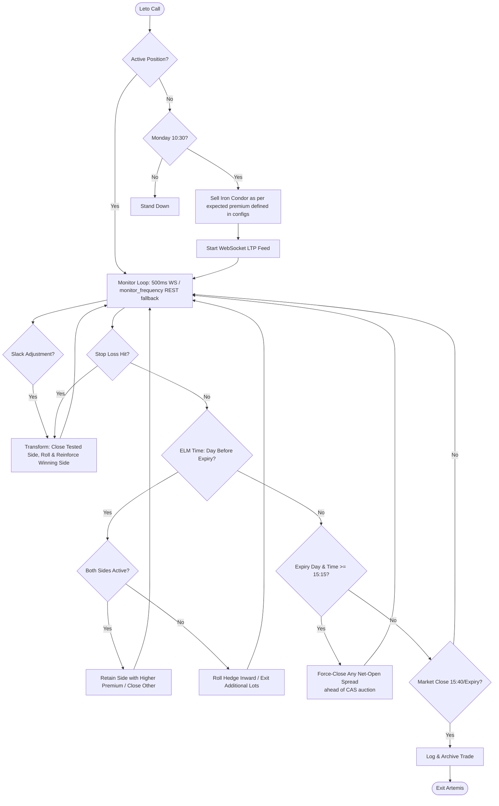

# Artemis Production — Sensex Dynamic Iron Condor (Live Execution)

Live execution module for the Artemis strategy.
Part of the **Algo Trading Lab** project.

Deployed when India VIX < 16. Sells a weekly Sensex **Iron Condor** on Monday at 10:30 AM.
If the market trends and a side is tested, the strategy dynamically transforms into a **reinforced directional credit spread** by exiting the losing side and rolling/reinforcing the winning side. It manages the position through to Thursday expiry.

## Module structure

| File | Purpose |
|---|---|
| `artemis.py` | Entry point — `run(obj, instrument_df)` called by Leto |
| `iron_condor.py` | IronCondor class — trade lifecycle, monitoring, adjustment, archival |
| `credit_spread.py` | CreditSpread class — individual PE/CE spread execution and SL logic; binary search strike selection |
| `artemis_configs.py` | All parameters — loaded from `data/` files at import time |
| `artemis_functions.py` | Slack messaging, Telegram fallback, exception handling |
| `artemis_logger_setup.py` | Rotating file logger |

Renamed 2026-08-07 from unprefixed `configs.py`/`functions.py`/`logger_setup.py`
— those names collide with identically-named files in `apollo_production/`,
`athena_production/`, and `iris_production/`. See
`plans/strategy-module-naming-collision-fix.md`.

## Setup on delos

```bash
cd /home/parijnan/scripts/algo-trading-lab/artemis_production
# Ensure data/ symlinks are in place:
#   data/user_credentials.csv -> ../../data/user_credentials.csv
#   data/holidays.csv         -> ../../data/holidays.csv
# Verify data/contracts.csv and data/trade_settings.csv are current
# Artemis is launched via Leto — not run directly
```

## Session model

Artemis does not manage its own Angel One session. Leto owns login, market/holiday
checks, scrip master download, and session teardown. Artemis receives:
- `obj` — authenticated `SmartConnect` instance
- `instrument_df` — Sensex BFO rows filtered from the scrip master

### Execution Flow



### CAS-aware expiry-day close
Since 3 Aug 2026, NSE/BSE run a Closing Auction Session: Sensex trading stops at 15:15 for a call auction, with the settlement price only discovered afterward and no continuous trading to react to it. To avoid carrying a still-open spread through that blind window, `evaluate_expiry_day_close()` force-closes any spread that is still net-open (`spread_status` not `closed`/`open`) at 15:15 on expiry day itself — distinct from the existing day-*before*-expiry ELM adjustment (`elm_time`, unaffected by CAS). The monitoring loop itself now runs to 15:40 (`closing_time` in `artemis_configs.py`), matching the extended derivatives session, but expiry-day exposure is deliberately cut off earlier at 15:15.

`iron_condor.set_session(obj, instrument_df)` propagates both to the PE and CE
spread objects and handles lot sizing if `lot_calc = true` in `trade_settings.csv`.

## Trade state

State is split across three files in `data/`:

| File | Purpose |
|---|---|
| `pe_trade_params.csv` | Full PE spread state — one row, overwritten on every change |
| `ce_trade_params.csv` | Full CE spread state — one row, overwritten on every change |
| `trade_book.csv` | Append-only leg-level log (entry, adjustment, exit rows) |
| `trade_log.csv` | Periodic monitoring snapshots (index LTP, spread LTPs, P&L) |

`spread_status` values in the trade params files:

| Value | Meaning |
|---|---|
| `open` | Spread initialised, waiting for entry time |
| `active` | Spread live, original lot count only |
| `active_additional` | Spread live with additional lots |
| `adjusted` | Sell leg rolled, no additional lots |
| `adjusted_additional` | Sell leg rolled with additional lots |
| `adjusted_elm` | Post-ELM hedge adjustment, original lots |
| `adjusted_additional_elm` | Post-ELM hedge adjustment with additional lots |
| `active_additional_elm` | Additional lots exited for ELM |
| `closed` | Spread fully exited |

At week end, `_archive_trade()` renames all state files into `data/archived/`
prefixed with the expiry date, leaving `data/` clean for the next week.

## Key config parameters (`data/trade_settings.csv`)

| Parameter | Description |
|---|---|
| `lot_size` | Sensex lot size (currently 20) |
| `lot_count` | Fixed lot count when `lot_calc = false` |
| `lot_calc` | If true, size from available margin at session start |
| `lot_capital` | Capital per lot for auto-sizing (Rs) |
| `expected_premium` | Target sell premium for strike selection |
| `hedge_points` | Distance of buy leg from sell leg |
| `sl_0_dte` to `sl_4_dte` | Option SL multipliers by days to expiry |
| `adj_dist` | Strike adjustment distance on SL hit |
| `index_sl_offset` | Index SL offset from sell strike |
| `monitor_frequency` | Slack/log reporting interval (seconds) — WS enables 500ms SL checks; this gates status updates |

## Status

**⚠️ DISABLED as of 2026-08-05, indefinitely.** NSE/BSE's Closing Auction Session (live 3 Aug 2026) is producing a large, consistent one-directional move on Nifty's closing-auction print — suspected closing-auction price manipulation under investigation, hurting the short-call side. No fixed re-enable date. See the CAS note in the root `CLAUDE.md` and `data_pipeline/data/cas_auction_tracking.csv` for current status before assuming this is trading again.

- [x] Iron condor execution — live and profitable
- [x] SL handling and spread adjustment — validated
- [x] ELM adjustment — validated
- [x] Trade archival — validated
- [x] Orphan fill cleanup — implemented across all execution paths (entry, exit, adjust, ELM)
- [x] WebSocket LTP feed — 500ms SL monitoring with REST fallback; Sensex index pre-subscribed at session start; auto-reconnect with exponential backoff; BSE exchange type correctly preserved in subscription registry so Sensex option legs resubscribe to the right exchange after reconnect
- [x] Position reconciliation on restart — sign-only broker position check on every in-trade restart; mismatch alerts to `#error-alerts`
- [x] Session summary — `run()` returns a summary dict to Leto (outcome, lots, P&L, exit reason) for the end-of-day session report
- [x] Leto integration — session management moved to Leto
- [x] Binary search strike selection — `_find_sell_strike()` replaces linear scan; O(log N) LTP calls with doubling extension for high-VIX out-of-range targets (up to 3 doublings = 8× initial range); linear fallback preserved as `_find_sell_strike_linear()`
- [x] Slack-triggered manual adjustment — `🔧 Adjust Artemis` button in Control Panel opens a modal to select which side to exit (PE/CE); writes `ADJUST:pe` or `ADJUST:ce` to `SLACK_COMMAND.flag`; monitoring loop picks it up within 0.5s and routes through the same `exit_spread` + `adjust_spread` execution path as an algo-triggered SL