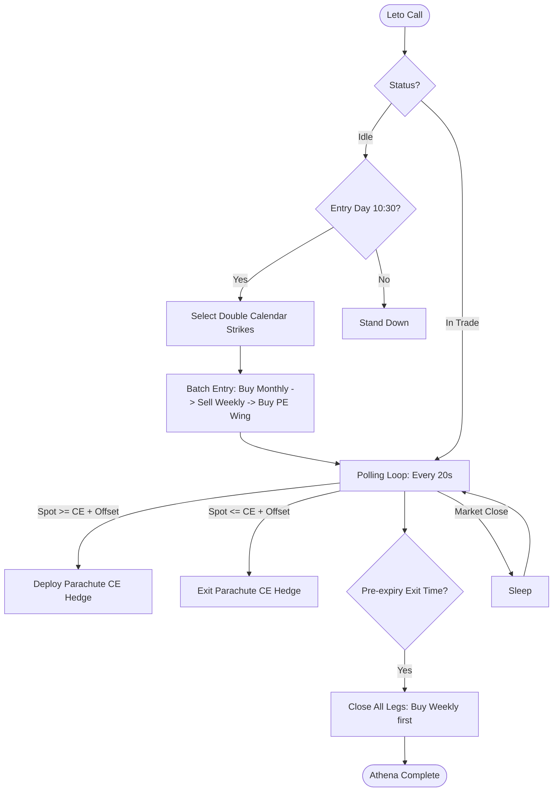

# Athena Production: Nifty Double Calendar Condor

Athena is a market-neutral, theta-positive strategy designed for mid-regime VIX (16–25). It executes a Double Calendar spread with far-OTM safety wings to cap extreme gap risk.

## Strategy Structure
- **Core:** 4-leg Double Calendar (Sell 0.30 Delta weekly, Buy same strikes on Monthly).
- **Hedge:** PE-Only Safety Wing (Buy 0.05 Delta on Monthly).
- **Emergency Hedge:** Smart Parachute (Buy Monthly CE if Spot >= CE Strike + 150).
- **Entry:** 10:30 AM on the day before the weekly sell expiry.
- **Exit:** 10:25 AM on the day before the weekly sell expiry (ELM).
- **Adjustments:** None (Static structure for maximum efficiency).

## Architecture
- `athena_engine.py`: Main execution engine (Entry, Polling Loop, Exit).
- `configs_live.py`: Strategy parameters and `ENABLE_SAFETY_WINGS` toggle.
- `state.py`: Atomic state management (CSV-backed) to handle restarts.
- `functions.py`: Slack/Telegram alerts and SmartAPI rate limiting.
- `logger_setup.py`: Dual console/file logging.

### Execution Flow

## Monitoring
Athena uses REST API polling (every 20 seconds) to fetch LTPs, calculate unrealised P&L, and log detailed snapshots to `data/trade_logs/`.

## Execution Safety
- **Capital-Efficient Sequence:** Always places **MONTHLY BUY** orders first to establish the calendar spread and secure margin benefits before selling weekly legs. Finally buys the PE wing using generated credit.
- **Dry Run Mode:** Set `DRY_RUN = True` in `configs_live.py` to test strike selection and logging without placing real orders.
- **Error Recovery:** State is persisted on every poll; the script automatically resumes tracking open positions if restarted.
