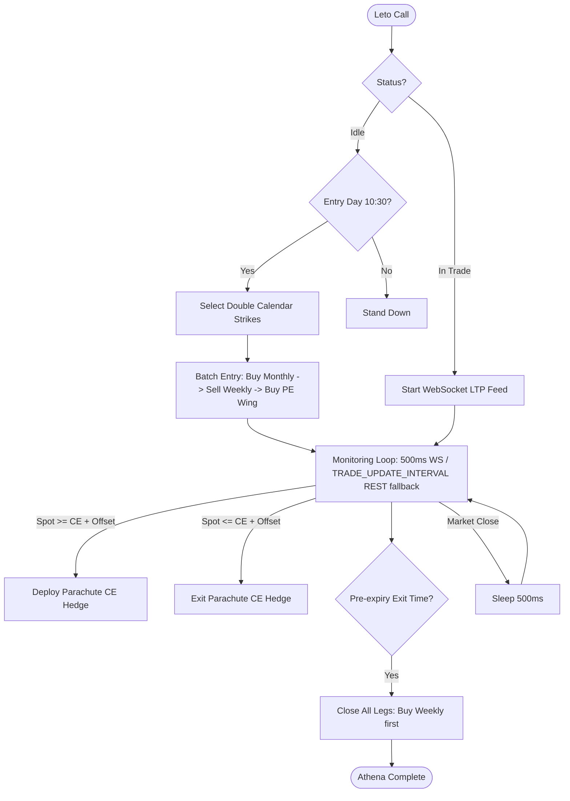

# Athena Production: Nifty Double Calendar Condor

Athena is a market-neutral, theta-positive strategy designed for mid-regime VIX (16–25). It executes a Double Calendar spread with far-OTM safety wings to cap extreme gap risk.

## Strategy Structure
- **Core:** 4-leg Double Calendar (Sell 0.30 Delta weekly, Buy same strikes on Monthly).
- **Hedge:** PE-Only Safety Wing (Buy 0.05 Delta on Monthly).
- **Emergency Hedge:** Smart Parachute (Buy Monthly CE if Spot >= CE Strike + 150).
- **Entry:** 10:30 AM on the day before the weekly sell expiry.
- **Exit:** 10:25 AM on the day before the weekly sell expiry (ELM).
- **Adjustments:** None (Static structure for maximum efficiency).

## Architecture
- `athena_engine.py`: Main execution engine (Entry, Polling Loop, Exit).
- `configs_live.py`: Strategy parameters, `QTY_FREEZE` limits, and `ORDER_TIMEOUT_SEC`.
- `state.py`: Atomic state management (CSV-backed) to handle restarts.
- `functions.py`: Slack/Telegram alerts and proactive rate limiting.
- `logger_setup.py`: Dual console/file logging.

### Execution Flow (Hardened)

Athena uses an **"Execution-Burst, Verification-Second"** architecture to minimize slippage and maximize reliability:

1.  **Batch Splitting:** Automatically splits orders (e.g., 41 or 60 lots) into chunks respecting the broker's `QTY_FREEZE` (1,800 shares) limit.
2.  **Burst Entry:**
    *   Fires a full batch burst: **Longs (Monthly) -> Shorts (Weekly)** in milliseconds.
    *   Establishes margin collateral *before* short legs hit the exchange.
3.  **Sub-Second Verification:**
    *   Instantly fetches the Order Book.
    *   Exits verification loop in **~150ms** if fills are confirmed.
    *   Only waits for the `ORDER_TIMEOUT_SEC` (1.1s) if a discrepancy or latency is detected.
4.  **Universal Orphan Janitor:**
    *   Performs a post-entry audit. If a batch partially failed, it instantly liquidates unbalanced legs to maintain strategy integrity.
5.  **Burst Exit:**
    *   Fires all closing orders (e.g., 10 orders for a 41-lot trade) in a single high-speed stream.
    *   Verifies fills only *after* the risk is removed to ensure accurate P&L reporting.

```mermaid
graph TD
    Start([Leto Call]) --> Status{Status?}
    
    Status -- Idle --> DayCheck{Entry Day 10:30?}
    DayCheck -- Yes --> Strikes[Select Double Calendar Strikes]
    Strikes --> Entry[Batch Entry: Buy Monthly -> Sell Weekly -> Buy PE Wing]
    Entry --> Poll[Monitoring Loop: 500ms WS / TRADE_UPDATE_INTERVAL REST fallback]
    
    Status -- In Trade --> WS[Start WebSocket LTP Feed]
    WS --> Poll
    
    Poll -- Spot >= CE + Offset --> Hedge[Deploy Parachute CE Hedge]
    Poll -- Spot <= CE + Offset --> Unhedge[Exit Parachute CE Hedge]
    
    Poll --> ExitCheck{Pre-expiry Exit Time?}
    ExitCheck -- Yes --> Close[Close All Legs: Buy Weekly first]
    Close --> End([Athena Complete])
    
    Poll -- Market Close --> Sleep[Sleep 500ms]
    Sleep --> Poll
    
    DayCheck -- No --> StandDown[Stand Down]
```

## Monitoring
Athena runs a `SharedFeed` WebSocket daemon (`websocket_feed.py`) for real-time LTP. Nifty spot and VIX index tokens are pre-subscribed at session start; option leg tokens are subscribed after entry and unsubscribed on exit. The in-trade loop runs at **500ms** intervals for sub-second SL and parachute reaction. Slack updates and `data/trade_logs/` snapshots fire every `TRADE_UPDATE_INTERVAL` seconds (counter-gated). If the WebSocket disconnects, the loop automatically falls back to REST polling at the full `TRADE_UPDATE_INTERVAL` interval.

## Execution Safety
- **Proactive Rate Limiting:** Client-side gatekeeper prevents the 11th order in a 1-second window, enforcing a 1.1s sleep *before* any violation.
- **ID-Exclusion Ghost Recovery:** Maintains a session list of processed `orderid`s. On network or data failure, it reconciles the Order Book using documented fields, preventing double-fills across batches.
- **Capital-Efficient Sequence:** Always places **MONTHLY BUY** orders first in the burst to establish the calendar spread and secure margin benefits before selling weekly legs. Finally buys the PE wing using generated credit.
- **Dry Run Mode:** Set `DRY_RUN = True` in `configs_live.py` to test strike selection and logging without placing real orders.
- **Error Recovery:** State is persisted on every poll; the script automatically resumes tracking open positions if restarted. On restart with an active trade, all live leg tokens are re-subscribed to the WebSocket feed.
