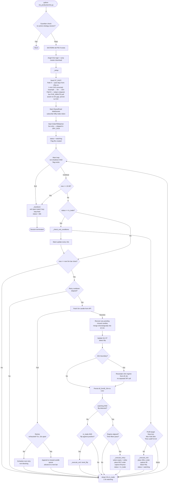

# Iris Production — Nifty Directional Scalping (Standalone)

Live execution module for the Iris strategy.
Part of the **Algo Trading Lab** project.

Iris monitors for high-conviction directional signals (ST_FAST: 5-min supertrend flip aligned with 15-min regime) and auto-enters a long ITM-150 Nifty option on signal. Unlike Artemis/Athena/Apollo, Iris owns its own Angel One session — it is not launched by Leto.

**Status: Live (`DRY_RUN=False`). Paper parity confirmed.**

---

## Module Structure

| File | Purpose |
|---|---|
| `iris.py` | Entry point and main class — `main()` to start, `Iris.run()` for the loop |
| `iris_configs.py` | All tuneable parameters |
| `iris_state.py` | `IrisState` dataclass + CSV-backed `save_state` / `load_state` |
| `iris_functions.py` | SupertrendIndicator, candle fetch, strike/expiry selection, order placement, `OrderFillWatcher`, guardian check, REST-fallback LTP fetch |
| `iris_logger_setup.py` | Rotating file logger (`logs/iris_YYYYMMDD.log`) |

Renamed 2026-08-07 from the unprefixed `configs.py`/`state.py`/`functions.py`/
`logger_setup.py` — those names collide with identically-named files in
`apollo_production/`, `athena_production/`, and `artemis_production/`, and
Python's `sys.modules` caching means whichever strategy's file imports first in
a process wins the name for every other strategy too. See
`plans/strategy-module-naming-collision-fix.md`.

---

## Execution Flow



---

## Signal: ST_FAST

- **Entry timeframe**: 5-min supertrend (period=10, multiplier=3.0)
- **Regime filter**: 15-min supertrend must align with flip direction
- On a bullish flip in a bearish 15-min regime: signal skipped
- On a bearish flip in a bullish 15-min regime: signal skipped
- Seed at startup — two paths, combined into one 5-min series:
  - **Path A** (past, fully-closed days): read `data_pipeline/data/indices/nifty.csv` (already CAS gap-filled/terminal-candle-corrected), truncate each day at 15:29, resample 1m → 5m → 15m from disk — no API calls, no rate-limit exposure
  - **Path B** (today's elapsed portion): live `FIVE_MINUTE` poll from market open to now, same as before — never the 1-min reconstruction, which applies only to past days. Retries up to `CANDLE_FETCH_RETRIES` times (`CANDLE_FETCH_RETRY_INTERVAL` apart, blocking — acceptable at one-time startup, unlike the live loop) before giving up; if it still comes up empty, seeding silently falls back to past-day-only data and `_setup()` fires a loud Slack alert (found the hard way 2026-08-10: a mid-session restart hit the rate limit on all inner attempts, seeded with only the prior day's close, and Iris briefly believed the 5m trend was bearish while it had actually been bullish for 23 minutes — self-corrected on the next live candle, but silently)
  - Combined series is asserted gap-free before being trusted (refuses to seed rather than compute ST over a hole); persisted to `data/iris_5m_series.csv` / `data/iris_15m_series.csv` after every update — for inspection/restart-recovery visibility only, never resumed from on restart (ST is always recomputed fresh from OHLC; see `plans/iris-signal-pipeline-hardening.md` §8)
- Live 15-min regime is resampled from the running 5-min series at each 15-min boundary — no separate `FIFTEEN_MINUTE` API call
- Candle-fetch resilience (§1 of the same plan): proactive client-side rate limit (`CANDLE_POLL_LIMIT=3`/sec), then a non-blocking outer retry (5 attempts, 10s apart — tracked via a "next retry due" timestamp so the in-trade exit-monitoring loop keeps polling every 0.5-1s throughout, never freezing on a stuck fetch). A bar that exhausts all retries goes into a persistent missed-candle queue, retried every subsequent loop iteration and merged into the ST history in correct chronological order once recovered.

---

## Entry Filters

| Filter | Value | Reason |
|---|---|---|
| `MIN_ENTRY_TIME` | 09:15 | No entry before market open |
| `MAX_ENTRY_TIME` | 15:00 | Last valid entry |
| `SKIP_ENTRY_WINDOWS` | 10:45–11:30 | Post-open dead zone: WR 31–43% in backtest |

---

## Instrument Selection

On each entry:
1. **Expiry**: nearest weekly Nifty expiry with `MIN_DTE >= 2` (skips same-day expiry)
2. **Strike**: 3 steps ITM (3 × 50 = 150 pts), rounded to nearest 50 on Nifty grid
3. **Option type**: CE (bullish) or PE (bearish)
4. **Token**: looked up from scrip master downloaded at startup

---

## Exit Conditions

All four are checked on every loop iteration while `status == in_trade`:

| Trigger | Condition | Typical outcome |
|---|---|---|
| Profit target | LTP ≥ entry × 1.10 | +10% premium gain |
| Stop loss | LTP ≤ entry × 0.75 | −25% premium loss |
| Trend flip | Opposite 5m ST flip | Nearly always a confirmed loss |
| Max hold | 30 min elapsed since entry | Exits stale trades |
| Time cutoff | now ≥ 15:15 | Daily hard cutoff |
| Market close | now ≥ 15:30 | Auto-shutdown with Slack notification |

---

## State Model

State is persisted to `data/iris_state.csv` on every change (atomic tmp-rename write).

| Field | Values |
|---|---|
| `status` | `idle` · `watching` · `in_trade` |
| `direction` | `bullish` · `bearish` · `None` |
| `option_type` | `ce` · `pe` · `None` |
| `strike` | integer · `None` |
| `expiry` | `YYYY-MM-DD` · `None` |
| `symbol` | full Angel One trading symbol · `None` |
| `token` | scrip token string · `None` |
| `entry_price` | fill premium per unit · `None` |
| `entry_spot` | Nifty spot at entry · `None` |
| `entry_time` | ISO timestamp · `None` |
| `lots` | integer |
| `last_ltp` | most recent LTP (for restart recovery) |

On restart mid-trade (`status == in_trade`): the option feed token is re-subscribed and monitoring resumes from the persisted `entry_price`.

---

## Process Lifecycle

| File | Purpose |
|---|---|
| `data/iris_active.flag` | Watchdog file — loop exits if deleted (clean stop) |
| `data/iris.pid` | PID of running process — `main()` SIGTERMs old PID on restart |
| `data/iris_state.csv` | Persistent state |
| `logs/iris_YYYYMMDD.log` | Daily rotating log |

**To stop Iris cleanly**: delete `iris_active.flag` or send SIGTERM to the process.  
**To restart**: run `main()` — it kills the old process and starts fresh.

---

## Guardian Check

Iris refuses to start if Artemis, Athena, or Apollo has an open position. Angel One allows only one active WebSocket session — a new Iris login would invalidate any running strategy session.

---

## Key Parameters (`iris_configs.py`)

| Parameter | Value | Notes |
|---|---|---|
| `DRY_RUN` | `False` | Live trading — paper parity was confirmed before flipping this |
| `LOT_SIZE` | 65 | Nifty standard lot |
| `LOT_COUNT` | 1 | Start small; increase after live validation |
| `ITM_DEPTH_STEPS` | 3 | 3 × 50 = 150 pts ITM |
| `PROFIT_TARGET_PCT` | 0.10 | +10% on entry premium |
| `STOP_LOSS_PCT` | 0.25 | −25% on entry premium |
| `MAX_HOLD_MIN` | 30 | Per-trade time cap |
| `EXIT_BY_TIME` | 15:15 | Daily cutoff |
| `MARKET_CLOSE` | 15:30 | Auto-shutdown time |
| `TRADE_UPDATE_SEC` | 10 | Slack update cadence while in_trade |
| `ORDER_TIMEOUT_SEC` | 30 | WS fast path + REST fallback timeout |
| `SEED_DAYS` | 13 | Calendar days of history for Path A's disk-based seed (past days) |
| `CANDLE_POLL_LIMIT` | 3 | Max `getCandleData` calls/sec (client-side, matches broker-wide cap) |
| `CANDLE_FETCH_RETRIES` | 5 | Extra retries after a candle fetch fails, before marking it missed |
| `CANDLE_FETCH_RETRY_INTERVAL` | 10 | Seconds between retries (non-blocking) |
| `CANDLE_POLL_JITTER_MS` | 200 | Delay before the first poll at each 5-min boundary only, not retries — untested hypothesis that polling at the exact clock tick collides with other bots on the broker (2026-08-10) |

---

## Order Fill Verification

`get_fill_price()` follows a two-path approach:
1. **Fast path**: `OrderFillWatcher` (WebSocket `SmartWebSocketOrderUpdate`) — listens for AB05 (complete) / AB02 / AB03 events; resolves as soon as fill confirmed
2. **Fallback**: REST `orderBook()` poll if WS doesn't confirm within `ORDER_TIMEOUT_SEC`
3. **DRY_RUN**: returns current feed LTP immediately (no order placed)

---

## Setup on Delos

```bash
# Ensure credentials are in place
ls iris_production/data/user_credentials.csv   # api_key, client_id, password, totp_token, slack_token
ls iris_production/data/holidays.csv           # market holiday list

# Verify DRY_RUN before any run — should read False for live trading
grep DRY_RUN iris_production/iris_configs.py

# Start (from repo root)
python iris_production/iris.py

# Stop cleanly
rm iris_production/data/iris_active.flag
```

---

## Backtest Reference

Calibrated from `iris_backtest/` (7.3 years, 1,172 trades):

| Metric | Value |
|---|---|
| Win rate | 59.8% |
| Avg P&L | ₹229/lot |
| Median P&L | ₹414/lot |
| Total (1 lot) | ₹268,798 |
| Profit target hit | 41% of trades |
| Stop loss hit | 2% of trades |
| Max hold exit | 54% of trades |
| Best window | 09:15 open (67.8% WR, 48% of total P&L) |

---

## Status

- [x] ST_FAST signal — implemented and seeded from API
- [x] ITM-150 strike selection — implemented
- [x] Four exit conditions — profit target, stop loss, trend flip, max hold
- [x] Time cutoff (15:15) and market-close auto-shutdown (15:30)
- [x] OrderFillWatcher — WS fast path + REST fallback
- [x] State persistence — atomic CSV write, mid-trade restart recovery
- [x] Guardian check — blocks start if another strategy has an open position
- [x] DRY_RUN paper mode — LTP-based fills, no real orders
- [ ] Paper parity confirmed (2–3 weeks paper trading in progress)
- [ ] DRY_RUN=False live deployment
