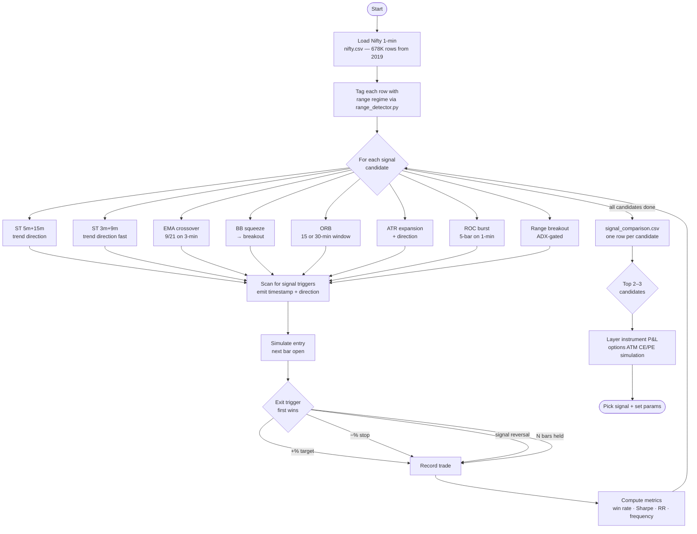
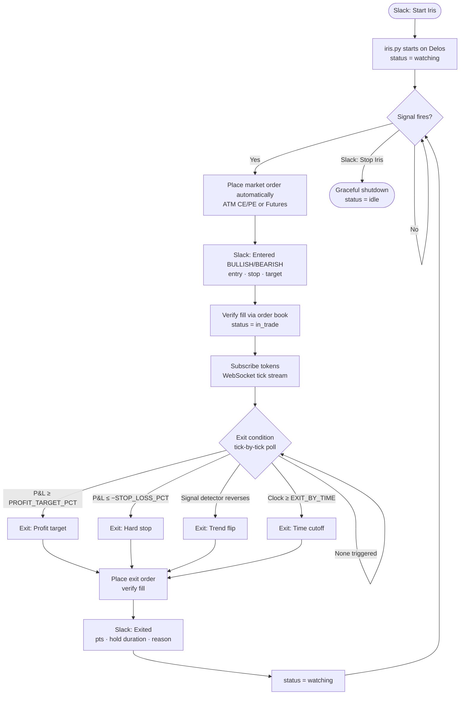

# Plan: Iris — Auto-Entry Scalping Strategy (Manual Arm/Disarm)

## Status: Exploratory / Backtest-First

No signal is pre-committed. Track A validates candidates before Track B is wired live.

---

## Context

A directional scalping strategy that monitors for high-conviction trend signals and
auto-enters on signal without per-trade approval. The trader arms/disarms the watchdog
via Slack; once armed, the algo trades autonomously. Started independently of Leto's VIX routing.

**Why two tracks:** The signal choice (what counts as "high-conviction") is the open question.
Committing to a signal before backtesting it is the mistake to avoid. The execution harness
(Track B) is signal-independent and can be built in parallel or after, but Track A must
produce evidence before the harness goes live.

---

## Track A — Signal Research (backtest-first, instrument-agnostic)

### Goal
Identify which signal detectors reliably catch directional moves worth trading.
Validate on the **index** (Nifty 1-min) first — measure points captured, not INR P&L.
Instrument P&L (options vs futures) is layered in later for the top 2–3 signals.

### Location
`research/scalp_signals/` — research tool, not production code.

### Data Available
- `data_pipeline/data/indices/nifty.csv` — 678K rows, 1-min, from 2019-05
- `data_pipeline/data/indices/sensex.csv` — 172K rows
- `data_pipeline/data/indices/india_vix.csv` — 678K rows, 1-min

### Candidates to Test (no pre-commitment)

15m+75m supertrend (Apollo's logic) is explicitly excluded — backtested, confirmed too slow;
targets often achieved the following day. Not suitable for same-session scalping.

| Signal | Captures | Timeframe | Reuse? |
|--------|----------|-----------|--------|
| Dual supertrend 5m+15m | Trend direction, faster | 5-min entry + 15-min regime | supertrend.py (different TF grouping) |
| Dual supertrend 3m+9m | Trend direction, fastest | 3-min entry + 9-min regime | supertrend.py (different TF grouping) |
| EMA crossover (fast/slow) | Trend direction | e.g. 9/21 EMA on 3-min | New, simple |
| BB squeeze → breakout | Volatility expansion directly | 3-min or 5-min | New |
| Opening Range Breakout (ORB) | Volatility expansion vs day baseline | 15-min or 30-min ORB window | New |
| ATR expansion + direction | Volatility expansion, momentum | ATR(5) > k × ATR(20) on 3-min | New |
| ROC burst | Raw momentum/velocity | 5-bar ROC > threshold on 1-min | New |
| Range breakout (ADX-gated) | Volatility expansion from consolidation | Daily regime + intraday break | range_detector.py |

**Priority for investigation:** BB squeeze and ORB are purpose-built for volatility expansion.
The supertrend variants and EMA crossover capture direction. ATR expansion and ROC capture
the momentum burst itself. Testing all allows a direct comparison across these different
"what triggers a scalp" philosophies.

### Sim Loop (index-only, no options)

For each signal candidate:
1. Scan 1-min data → emit `(timestamp, direction, signal_type)` on trigger
2. Simulate entry at `trigger_ts + 1 bar` (next open)
3. Simulate exit at whichever fires first:
   - Fixed % target (e.g. +0.3%, +0.5%) on index
   - Fixed stop (e.g. −0.15%, −0.2%) on index
   - Signal reversal (same detector flips)
   - Fixed bars held (e.g. 10, 20, 30 candles)
4. Record: entry/exit time, direction, index points, hold duration, exit reason

### Metrics Per Signal
- Entries/year, signal frequency
- Win rate, average winner / average loser, RR ratio
- Sharpe (annualised), max drawdown (points)
- Breakdown by: time-of-day, VIX regime, day-of-week, ranging vs trending

### Reusable Building Blocks
- Data loading pattern from any existing backtest (canonical `pd.read_csv + tz_localize`)
- `apollo_production/supertrend.py` — reuse `SupertrendIndicator.calculate()` directly
- `research/range_detection/range_detector.py` — `compute_ranges()` for regime tagging
- ADX/swing utilities already in `data_pipeline/range_detector.py`

### Deliverable
`research/scalp_signals/signal_comparison.csv` — one row per signal candidate with all metrics.
Based on results: pick top 2 candidates and run instrument P&L layer (options simulation).

---

## Track B — Execution Harness (signal-independent, Slack-activated)

**Build after Track A identifies a viable signal.** Architecture designed for any signal.

### Location
`iris_production/` — mirrors structure of `apollo_production/`

### Files

```
iris_production/
  iris.py        — main loop: monitor, execute, manage exit
  state.py       — IrisState dataclass (status + trade fields)
  configs.py     — all tuneable params (signal TF, exit thresholds, instrument)
  functions.py   — order placement, LTP helpers (thin wrappers on Angel One API)
```

### State Lifecycle

```
idle
  → watching        (Slack "Start Iris" — watchdog armed)
      → in_trade    (signal fires → order placed automatically)
          → watching    (trade exits → continue watching)
      → idle        (Slack "Stop Iris" — watchdog disarmed)
```

No per-signal approval. Once armed, the algo auto-enters on every valid signal.
Slack receives a notification when a trade opens and closes (informational, not a gate).

### Slack Integration (new buttons in control panel)

Add to `slack_listener.py` — new "Iris Scalper" section:
- **▶ Start Iris** — spawns iris.py process on Delos, writes `iris_active.flag`
- **⏹ Stop Iris** — removes flag, triggers graceful shutdown

### Slack Notifications (informational only, no approval gate)

On signal fire and entry:
```
⚡ *Iris*: Entered BULLISH
Nifty: 23,540 | Signal: BB squeeze breakout
Entry: 23,545 | Stop: 23,480 | Target: 23,615
```

On exit:
```
✅ *Iris*: Exited — Profit target hit
Entry: 23,545 → Exit: 23,612 | +67 pts | 00:08 held
```

### Entry
- Instrument determined by configs.py (options: ATM CE/PE; futures: Nifty/Sensex FUT)
- Market order (only order type available in current infra)
- Fill verified via order book (same pattern as Apollo `_execute_entry`)

### Exit (first condition wins)

| Condition | Mechanism |
|-----------|-----------|
| Profit target | Unrealised P&L ≥ `PROFIT_TARGET_PCT` × entry cost |
| Hard stop | Unrealised P&L ≤ −`STOP_LOSS_PCT` × entry cost |
| Trend flip | Same detector that triggered entry reverses |
| Time cutoff | Clock reaches `EXIT_BY_TIME` (e.g. 15:00) |

All exit conditions polled tick-by-tick via WebSocket (same `websocket_feed.py::SharedFeed`).

### Instrument Abstraction
`configs.py` holds an `INSTRUMENT` block. Options and futures differ only in:
- Token lookup (options: strike selection from master; futures: fixed token)
- Lot size and margin
- P&L calculation (options: net debit model; futures: linear tick × lot)

No other code path changes between instruments.

---

## Build Sequence

1. **Track A — Signal harness** (`research/scalp_signals/signal_backtest.py`)
   - Build generic sim loop on Nifty 1-min
   - Implement all 8 signal candidates
   - Run comparison, review results
2. **Track A — Instrument layer** (optional, only for top signals)
   - Add options backtest layer: ATM call/put entry at signal time, % exit model
3. **Pick signal + set params** based on backtest evidence
4. **Track B — Build harness** (`iris_production/`)
   - State, configs, Slack buttons, entry/exit logic
5. **Paper trade** for 2–3 weeks (Slack alerts, no real orders)
6. **Live deploy** (small lot count, monitored)

---

## Constraints

- No production wiring until Track A produces a candidate with evidence.
- No changes to Leto, Artemis, Athena, or Apollo during this work.
- Futures trading requires broker-side enabling (margin product, instrument availability) —
  confirm with Angel One before building futures order path.

---

## Flowcharts

### Track A — Signal Research Pipeline



### Track B — Live Operational Flow


