# Prometheus Production — MCX Crude Oil Intraday Trend-Following (Standalone)

Live execution module for the Prometheus strategy.
Part of the **Algo Trading Lab** project.

Prometheus watches for ST_15 (single-timeframe, 15-min Supertrend) flips on CRUDEOILM futures
and auto-enters a 2-lot scale-out position on signal. Unlike Artemis/Athena/Apollo, and like
Iris, Prometheus owns its own Angel One session — it is not launched by Leto (different
exchange, different underlying, no VIX coupling; see
[`plans/prometheus-phase2-production.md`](../plans/prometheus-phase2-production.md) §0).

**Status: Built, `DRY_RUN=True` (paper mode). Not yet live-tested.** Reverted to paper mode
2026-08-31 after a real incident — see Status section at the bottom before touching `DRY_RUN`.

---

## Module Structure

| File | Purpose |
|---|---|
| `prometheus.py` | Entry point and main class — `main()` to start, `Prometheus.run()` for the loop |
| `prometheus_configs.py` | All tuneable parameters — deliberate duplicate of `prometheus_backtest/phase2/configs_p2.py`'s calibrated values, not an import (matches `iris_configs.py`'s convention: production must never silently follow future backtest experimentation) |
| `prometheus_state.py` | `PrometheusState` dataclass + CSV-backed `save_state`/`load_state` |
| `prometheus_functions.py` | `SupertrendIndicator`, effective-contract resolution, MCX holiday calendar, resilient 1-min poller, order placement, `OrderFillWatcher`, fill verification, trade-log/counter persistence, guardian check |
| `prometheus_logger_setup.py` | Rotating file logger (`logs/prometheus_YYYYMMDD.log`) |

---

## Execution Flow

```mermaid
graph TD
    Start([python prometheus_production/prometheus.py]) --> Holiday{MCX fully closed today?\nmcx_holidays.csv}
    Holiday -- Yes --> AbortHoliday([Exit — not starting])
    Holiday -- No --> Disable{prometheus_command.flag\n== DISABLE?}
    Disable -- Yes --> AbortDisable([Exit — disabled via Slack])
    Disable -- No --> Guardian{Guardian check:\nno other active strategy session?}
    Guardian -- Fail --> AbortGuardian([Exit — exclusive session required])
    Guardian -- Pass --> KillOld[SIGTERM old PID if exists]
    KillOld --> Login[Angel One login]
    Login --> Setup[_setup]

    Setup --> Contract[resolve_effective_contract:\nexchange front-month, UNLESS\n< 5 trading days to its expiry\n-- then roll to next contract out]
    Contract --> Seed[seed_st15:\ntail-read SEED_DAYS=18 days 1-min,\nresample to 15m, compute ST\ngap-checked -- refuses to seed on a hole]
    Seed -- Fail --> AbortSeed([Exit — seed failed])
    Seed -- OK --> TodayAccum[Seed today's in-memory\n1-min accumulator from disk]
    TodayAccum --> Feed[Start SharedFeed WebSocket\nsubscribe MCX contract token\npermanent for the session]
    Feed --> OrderWS[Start OrderFillWatcher\nlive only -- skipped in DRY_RUN]
    OrderWS --> Resume{Resuming with\nstatus == in_trade?}
    Resume -- Yes --> ResumeWarn[Rebuild pending_trade_row from state\nSlack: NOT reconciled against broker --\nverify manually]
    Resume -- No --> Watching[status = watching]
    ResumeWarn --> LoopStart
    Watching --> LoopStart[Main loop armed]

    LoopStart --> Loop{not shutdown AND\nflag exists AND\nnow < SESSION_END_TIME?}
    Loop -- No --> Teardown[_teardown]
    Teardown --> End([Session terminated])

    Loop -- Yes --> CmdFlag{prometheus_command.flag\n== EXIT or KILL?}
    CmdFlag -- EXIT --> ForceExitAll[_execute_exit_all: slack_exit] --> RaiseStop[Raise -- session terminates]
    CmdFlag -- KILL --> SetKillFlag[_kill_no_exit = True\nposition left untouched] --> RaiseStop
    RaiseStop --> Teardown

    CmdFlag -- No --> InTrade{status == in_trade?}
    InTrade -- Yes --> ExitCheck[_check_exit_conditions_ltp\nevery 0.5-1s tick]
    ExitCheck --> UpdateCadence{TRADE_UPDATE_SEC\nelapsed?}
    UpdateCadence -- Yes --> SlackUpdate[Slack unrealised P&L update]
    UpdateCadence -- No --> BoundaryCheck
    SlackUpdate --> BoundaryCheck

    InTrade -- No --> BoundaryCheck{1-min boundary\nreached?}
    BoundaryCheck -- No --> Sleep[sleep 0.5s in_trade\n1.0s watching] --> Loop
    BoundaryCheck -- Yes --> Recover[Recover any pending windows\nfrom outer retry queue]
    Recover --> Fetch[fetch_one_minute_window\n5-min lookback, inner retry x3]
    Fetch -- Fail --> QueuePending[Push to pending_recovery\nnon-blocking, retried next boundary] --> Merge15Check
    Fetch -- OK --> MergeWrite[_merge_1m:\nwrite into contract's shared file\n+ update in-memory today accumulator]
    MergeWrite --> Merge15Check{boundary.minute\n% 15 == 0?}
    Merge15Check -- Yes --> Handle15m[_handle_new_15m_bar]
    Merge15Check -- No --> RunningRowCheck
    Handle15m --> RunningRowCheck{status == in_trade?}
    RunningRowCheck -- Yes --> AppendRow[Append running-P&L row\ntrade_logs/trade_NNNN_*.csv]
    RunningRowCheck -- No --> Sleep
    AppendRow --> Sleep

    ExitCheck --> ExitEOD{now >= EOD_SQUAREOFF_TIME?}
    ExitEOD -- Yes --> ExitAllEOD[_execute_exit_all: eod_squareoff] --> Sleep
    ExitEOD -- No --> ExitSL{SL hit on LTP?}
    ExitSL -- Yes --> ExitAllSL[_execute_exit_all: stop_loss\nSL wins any same-tick tie vs a target] --> Sleep
    ExitSL -- No --> ExitT1{lot1 open AND\nlot1_target hit?}
    ExitT1 -- Yes --> ExitLot1[_execute_exit_lot 1: target1]
    ExitT1 -- No --> ExitT2
    ExitLot1 --> ExitT2{lot2 open AND\nlot2_target hit?}
    ExitT2 -- Yes --> ExitLot2[_execute_exit_lot 2: target2_source]
    ExitT2 -- No --> BothClosedCheck
    ExitLot2 --> BothClosedCheck{both lots\nnon-open?}
    BothClosedCheck -- Yes --> Finalize[_finalize_trade:\nappend to prometheus_trades.csv\nSlack trade-closed summary\nstate reset to watching]
    BothClosedCheck -- No --> Sleep
    Finalize --> Sleep

    Handle15m --> Build15m[Build 15m OHLCV bar from\nthis window's 1-min data\nalert loudly if < 8/15 bars present]
    Build15m --> RecomputeST[compute_st over full series\npersist_15m_series -- debug visibility only]
    RecomputeST --> FlipCheck{trend_flip == True?}
    FlipCheck -- No --> RunningRowCheck
    FlipCheck -- Yes --> InTradeFlip{status == in_trade?}
    InTradeFlip -- Yes --> DirCheck{flip direction !=\ncurrent position direction?}
    DirCheck -- No --> RunningRowCheck
    DirCheck -- Yes --> Rule7Exit[_execute_exit_all: trend_flip]
    Rule7Exit --> Rule7Confirmed{Exit confirmed\nfully closed?}
    Rule7Confirmed -- No --> Rule7Abort[Re-entry SKIPPED\nlogged critical] --> RunningRowCheck
    Rule7Confirmed -- Yes --> Rule7Gate{after MIN_ENTRY_TIME AND\nbefore LAST_ENTRY_TIME?}
    Rule7Gate -- Yes --> Entry[_execute_entry:\nnew direction, same 15m bar]
    Rule7Gate -- No --> RunningRowCheck

    InTradeFlip -- No --> FreshGate{status == watching AND\nafter MIN_ENTRY_TIME AND\nbefore LAST_ENTRY_TIME?}
    FreshGate -- Yes --> Entry
    FreshGate -- No --> RunningRowCheck

    Entry --> Units[_calculate_units + margin check]
    Units --> PlaceOrder[place_order:\n2 x units x LOTS_PER_LEG lots]
    PlaceOrder -- Fail --> EntryAbort[Log error -- no position opened] --> RunningRowCheck
    PlaceOrder -- OK --> FillVerify[get_fill_price_and_qty:\nWS fast path + REST fallback]
    FillVerify -- Fail --> EntryAbort
    FillVerify -- OK --> SplitLots[Split filled lots -> lot1/lot2\npartial-fill aware: lot2 may\nnever open, never retried]
    SplitLots --> Thresholds[resolve_thresholds + resolve_target2:\nsl_price, lot1_target, lot2_target]
    Thresholds --> NewState[New PrometheusState: in_trade\nsave_state, Slack entry message]
    NewState --> RunningRowCheck
```



---

## Signal: ST_15

- **Timeframe**: single 15-min Supertrend (`ST_PERIOD=10`, `ST_MULTIPLIER=3.0`) — no regime gate,
  unlike Iris's dual-timeframe design. Same signal `prometheus_backtest/phase2/backtest_p2.py`
  was calibrated against.
- **Seed at startup**: `seed_st15()` tail-reads `SEED_DAYS=18` calendar days of 1-min history
  from the effective contract's own file, resamples to 15-min, computes ST — explicitly
  gap-checked, refuses to seed across a hole rather than silently computing over one (unlike
  Iris's Path A/B, there's no live-poll fallback path here — a bad seed aborts startup outright).
- **Live update**: every 1-min boundary, the last 5 minutes are polled and merged into the
  in-memory today-accumulator; on each 15-min boundary (`minute % 15 == 0`), a fresh 15m bar is
  built from that window, appended to the full series, and ST is recomputed over the whole
  thing (`compute_st`, not incremental — matches the backtest's own computation exactly).
  Persisted to `data/prometheus_15m_series.csv` after every bar — for inspection/restart-recovery
  visibility only (§4 of the plan), never resumed from directly on restart (ST always recomputes
  fresh from the seeded + accumulated 1-min history).
- **Missing-bar handling**: a 15-min boundary can fire while the 1-min poller's own recovery
  queue is still catching up. If the window has zero 1-min bars, the 15m bar is skipped outright
  (a gap in the ST series, alerted loudly); if it has fewer than 8 of the expected 15, the bar is
  still built from what's available, also alerted — "no silent staleness," matching the seed's
  own refusal-to-guess philosophy but unable to fully refuse mid-session the way the seed can.

---

## Entry / Exit Priority

Checked in this order on every loop tick while `status == in_trade` (`_check_exit_conditions_ltp`):

| Priority | Trigger | Notes |
|---|---|---|
| 1 | EOD square-off | `now >= EOD_SQUAREOFF_TIME` — clock-driven, not grid-snapped, always wins |
| 2 | Stop loss | Single shared level protecting whichever lot(s) remain open; wins any same-tick tie against a target (`backtest_p2.py` convention) |
| 3 | Lot 1 target | `TARGET1_PCT=1.0%` of entry |
| 4 | Lot 2 target | `TARGET2_MODE='flat_pct'`, `TARGET2_FLAT_PCT=2.3%` of entry |
| — | Trend flip | Checked separately, only on a 15-min boundary — closes whichever lot(s) remain open AND is itself the entry for the opposite direction, resolved at the same bar ("rule 7") |

Entries (fresh or rule-7 re-entry) require both `now >= MIN_ENTRY_TIME` (09:15) and the signal
bar to be at/before `LAST_ENTRY_TIME` — the grid-snapped cutoff derived from
`CLOSING_TIME - MAX_ENTRY_BEFORE_CLOSE_MIN`, rounded to the nearest 15-min boundary since
entries only ever happen on 15-min bar opens.

**Rule 7's re-entry is gated on confirmed exit.** `_execute_exit_all` returns `True` only if the
position ended up genuinely flat; a same-bar opposite-direction entry only fires if that's
`True`. Firing a fresh entry while the exit itself failed to confirm would mean attempting to
hold both directions at once against a position with an unknown real state — the exact class of
bug behind the 2026-08-31 incident (see Status).

---

## Fill-Confirmation Invariant (hard rule, added after a real incident)

`_execute_exit_lot` returns `True` **only** if the exit is genuinely confirmed: a real order ID,
a real fill, filled quantity > 0. On any failure, that lot's status is left untouched (still
`open`) — no fabricated fill price, no P&L, no Slack success message. The next tick's exit-check
(every 0.5–1s) retries automatically; no separate retry loop is needed, and no lie enters the
state file or trade log.

This exists because of a real 2026-08-31 incident: a trend-flip exit order failed at the broker
(`orderid=None`) with no guard against it, and the prior code fabricated a fill from LTP anyway
— both lots marked closed internally while the real 2-lot long stayed open and unmonitored at
the broker for ~28 minutes until caught manually. Fixed via a three-layer confirmation check
that this invariant, rule 7's re-entry gate, and `_teardown()`'s own exit-confirmation check all
now share. `DRY_RUN` was reverted to `True` the same day and has not been flipped back — see
Status.

---

## Instrument & Contract Roll

| | |
|---|---|
| Instrument | `CRUDEOILM` (default) or `CRUDEOIL` — Slack-switchable (`btn_prometheus_instrument`), writes `data/instrument_override.json` (`symbol` + `margin_per_unit` together, since the two are coupled — different lot sizes, 10 vs 100 barrels) |
| Lot size | Looked up live from `data_pipeline/data/mcx_instrument_master.csv`, never hardcoded |
| Roll rule | `resolve_effective_contract()`: the exchange's own front month, **unless** fewer than `TENDER_ROLL_TRADING_DAYS=5` trading days (via `mcx_holidays.csv`) remain until its expiry — then the *next* contract out, re-seeding ST from scratch on that contract's own history |
| Why roll early | Capital efficiency over strict backtest parity — avoids MCX's elevated tender-margin window on energy contracts in a departing contract's final days (plan §1/§6, explicit user decision) |
| ST computation | Per-contract only, never spliced across a roll — a raw price-level jump at the roll boundary would otherwise risk a spurious flip driven by nothing but switching instruments |

---

## State Model

State is persisted to `data/prometheus_state.csv` on every change (atomic tmp-rename write).

| Field | Values |
|---|---|
| `status` | `idle` · `watching` · `in_trade` |
| `direction` | `bullish` · `bearish` · `None` |
| `units` | integer — **persisted verbatim, never recomputed on restart** (a config change between a crash and a restart must not silently change an already-open trade's risk parameters) |
| `entry_price` / `entry_ts` | fill price / ISO timestamp |
| `signal_ts` / `signal_close` | the 15m bar whose close triggered the flip |
| `contract_expiry` / `symbol` / `token` | the resolved effective contract at entry |
| `sl_price` | persisted verbatim, not recomputed |
| `lot1_target` / `lot2_target` / `lot2_target_source` | persisted verbatim, not recomputed |
| `lot1_lots` / `lot2_lots` | actual filled lot count per leg — partial-fill aware |
| `lot1_status` / `lot2_status` | `open` · `booked` · `never_opened` (per-lot lifecycle) |
| `lot1_exit_*` / `lot2_exit_*` | price, timestamp, reason — set only on a confirmed fill |
| `last_known_ltp` | most recent LTP, for restart recovery and session-report fallback |

**On restart mid-trade**: `_setup()` reconstructs `_pending_trade_row` from the persisted state
(so a crash doesn't lose `trade_id`/entry fields when the trade eventually closes) and posts a
loud Slack notice — the resumed state is trusted as-is, **not** reconciled against the broker's
actual order book (a flagged gap, same as Iris/Athena today; see the plan's §4 discussion).

---

## Process Lifecycle

| File | Purpose |
|---|---|
| `data/prometheus_active.flag` | Watchdog file — loop exits if deleted (clean stop) |
| `data/prometheus.pid` | PID of running process — `main()` SIGTERMs old PID on restart |
| `data/prometheus_command.flag` | Circuit breaker: `EXIT` / `KILL` / `DISABLE` — Prometheus's own dedicated flag, separate from the shared NSE/BSE `SLACK_COMMAND.flag`, so an operator managing one exchange can't accidentally kill the other |
| `data/prometheus_state.csv` | Persistent trade state |
| `data/prometheus_trades.csv` | Cumulative append-only trade tracker, schema-matched to `trade_summary_p2.csv` plus `units` |
| `data/trade_logs/trade_NNNN_*.csv` | Per-trade running log — one row per 1-min poll cycle while in-trade, same columns as the backtest's own per-trade logs |
| `data/trade_counter.txt` | Persistent sequential trade ID counter (Apollo's convention, survives restarts) |
| `logs/prometheus_YYYYMMDD.log` | Daily rotating log |

**`EXIT`** liquidates any open position and terminates the session. **`KILL`** drops control
immediately and leaves any open position **untouched** — deliberately, per its own promised
contract ("Control dropped. Position remains OPEN.") — `_teardown()` checks `_kill_no_exit` and
skips its normal auto-flatten specifically to honor that. **`DISABLE`** is a startup-only gate,
checked in `main()` before the `Prometheus` object is even constructed.

---

## Guardian Check

Prometheus refuses to start if Apollo, Athena, Artemis, or Iris has an open position (shared
Angel One account, shared rate-limit budget — a second concurrent login can disrupt an already-
running session). Symmetric with Iris's own guardian check against the other three.

---

## Key Parameters (`prometheus_configs.py`)

| Parameter | Value | Notes |
|---|---|---|
| `DRY_RUN` | `True` | Paper mode — see Status below before flipping this |
| `SYMBOL` | `CRUDEOILM` | Slack-switchable; `CRUDEOIL` for the full-size contract |
| `LOT_SIZE` | looked up live | 10 barrels (CRUDEOILM) / 100 barrels (CRUDEOIL) |
| `LOTS_PER_LEG` | 1 | 1 unit = 2 lots (1 lot each leg) |
| `DYNAMIC_SIZING` | `False` | Static at go-live; Artemis's margin-based formula when enabled |
| `STATIC_UNITS` | 1 | Starting size |
| `MARGIN_PER_UNIT` | 100,000 | ₹ — coupled to `SYMBOL`, overridden together via Slack |
| `ST_PERIOD` / `ST_MULTIPLIER` | 10 / 3.0 | Matches `configs_p2.py`'s calibrated signal |
| `SL_PCT` | 1.8% | Single shared stop |
| `TARGET1_PCT` | 1.0% | Lot 1 |
| `TARGET2_MODE` / `TARGET2_FLAT_PCT` | `flat_pct` / 2.3% | Lot 2 — hardcoded `'pct'` mode in production per Rollout step 5 |
| `TENDER_ROLL_TRADING_DAYS` | 5 | Trading days before expiry to roll early |
| `SEED_DAYS` | 18 | Calendar days of 1-min history tail-read for ST seeding |
| `MIN_ENTRY_TIME` | 09:15 | No entry before |
| `CLOSING_TIME` | 23:30 | **DST-dependent — must be hand-toggled around US DST changes** (→23:30 ~2nd Sun March, →23:55 ~1st Sun Nov) |
| `MAX_ENTRY_BEFORE_CLOSE_MIN` | 60 | → `LAST_ENTRY_TIME`, grid-snapped to the nearest 15-min boundary |
| `EOD_SQUAREOFF_BEFORE_CLOSE_MIN` | 15 | → `EOD_SQUAREOFF_TIME`, clock-driven, not grid-snapped |
| `SESSION_END_BUFFER_MIN` | 25 | → `SESSION_END_TIME`, the main loop's own hard exit clock |
| `CANDLE_POLL_LIMIT` / `LTP_POLL_LIMIT` | 3 / 10 per sec | Broker-wide client-side rate caps |
| `ORDER_TIMEOUT_SEC` | 30 | WS fast path + REST fallback timeout |
| `TRADE_UPDATE_SEC` | 20 | Slack update cadence while in-trade — matches Artemis's/Athena's convention, not Iris's 10s |

---

## Order Fill Verification

`get_fill_price_and_qty()` follows the same two-path approach as Iris:
1. **Fast path**: `OrderFillWatcher` (WebSocket `SmartWebSocketOrderUpdate`) — resolves as soon
   as a fill is confirmed
2. **Fallback**: REST order-book poll if WS doesn't confirm within `ORDER_TIMEOUT_SEC`
3. **DRY_RUN**: returns the current feed LTP immediately (no order placed)

Unlike Iris, this path is genuinely load-bearing for a 2-lot entry: a **partial fill** (only 1 of
2 lots fills) is treated as an intentional single-lot trade — lot 2 simply never opens, and is
never retried (retrying introduces its own entry-price-drift risk; per the plan, single-lot
economics are already understood as an acceptable degraded mode, not a crisis).

---

## Setup on Delos

```bash
# Ensure data/ symlinks are in place:
#   data/user_credentials.csv -> ../../data/user_credentials.csv
ls prometheus_production/data/instrument_override.json 2>/dev/null   # optional, absent = SYMBOL default

# Verify DRY_RUN before any live run — should read False only after the
# Rollout plan's steps 2-4 are complete (order-update WS parity check,
# backtest/live parity, a fresh DRY_RUN pass under real conditions)
grep DRY_RUN prometheus_production/prometheus_configs.py

# Start (from repo root) — Prometheus owns its own session, not Leto-launched
python prometheus_production/prometheus.py

# Stop cleanly
rm prometheus_production/data/prometheus_active.flag
```

---

## Backtest Reference

Calibrated from `prometheus_backtest/phase2/` — see
[`prometheus_backtest/README.md`](../prometheus_backtest/README.md) for the full calibration
journey (including **Prometheus's own Phase 3**, a second, backtest-only design track with a
pending decision between two multiplier candidates — not yet folded into this production
module; see that README's Phase 3 section before assuming Phase 2's parameters above are final).

| Metric | Value |
|---|---|
| Config | `THRESHOLD_MODE='pct'`, `SL_PCT=1.8`, `TARGET1_PCT=1.0`, `TARGET2_MODE='flat_pct'`, `TARGET2_FLAT_PCT=2.3` |
| Trades | 221 (refreshed through the latest candle, 2026-09-01) |
| Win rate | 55.2% |
| Total P&L | ₹42,453 |
| Max drawdown | −₹14,943 |
| Calmar | 2.84 (unitless) / 4.85 (annualized, ₹1L capital basis) |
| Cross-validation | Confirmed on CRUDEOIL (full-size contract) before being trusted |

---

## Status

- [x] Effective-contract resolution — exchange front-month with 5-trading-day-early roll
- [x] ST_15 seeding — gap-checked tail-read, refuses to seed across a hole
- [x] Resilient 1-min polling — inner retry + non-blocking outer recovery queue
- [x] 2-lot scale-out entry — partial-fill aware, lot 2 never retried if it doesn't fill
- [x] Four exit conditions — SL, lot1 target, lot2 target, EOD square-off, plus trend-flip (rule 7, same-bar re-entry)
- [x] Fill-confirmation invariant — no lot is ever marked closed without a genuine confirmed fill
- [x] State persistence — atomic CSV write, mid-trade restart recovery (not yet broker-reconciled)
- [x] Guardian check — blocks start if another strategy has an open position
- [x] Own circuit breaker — `prometheus_command.flag`, separate from the shared NSE/BSE one
- [x] DRY_RUN paper mode — LTP-based fills, no real orders
- [x] Session report — per-trade + session-total Slack summary at teardown
- [ ] **Order-update WebSocket unverified for MCX** — worked during the brief 2026-08-31 live
      window (four real fills resolved via WS), but that window was cut short by the incident
      below before a full session could confirm it under sustained live conditions
- [ ] **DRY_RUN=False live deployment** — reverted to `True` on 2026-08-31 after a real incident:
      a trend-flip exit order failed at the broker with no guard against it, and the code
      fabricated a fill from LTP, marking both lots closed internally while the real position
      stayed open and unmonitored for ~28 minutes. Fixed via the fill-confirmation invariant
      above (commit `8b7bc5b`). **Do not flip `DRY_RUN` back to `False` until that fix has held
      up under a fresh DRY_RUN pass**, per `prometheus_configs.py`'s own comment.
- [ ] Backtest/live parity check (Rollout step 3, plan)
- [ ] Broker-side reconciliation on mid-trade restart (flagged gap, shared with Iris/Athena)
